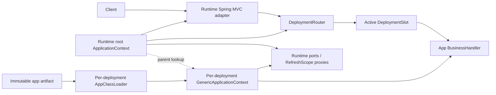

# Spring Boot Runtime 중심 Hot Deploy 설계

## 1. 결론

이 프로젝트는 다음 구조로 구현한다.

- `runtime`만 Spring Boot 애플리케이션으로 실행한다.
- `runtime`의 JVM, embedded web server, root `ApplicationContext`는 최초 한 번만 시작한다.
- `app`은 Spring Boot 애플리케이션이 아니라 Spring-free 비즈니스 모듈 JAR이다.
- `app`은 실행 호스트인 `runtime` 구현체가 아니라, Spring 의존성이 전혀 없는 공개 계약 `runtime-api`에만 의존한다.
- app artifact마다 전용 classloader와 runtime이 소유하는 child `GenericApplicationContext`를 새로 만든다.
- 새 app을 완전히 검증한 뒤 현재 deployment pointer를 원자적으로 교체한다.
- 코드 변경은 app classloader/context 교체로 반영하고, 설정 변경은 Spring Cloud Context로 runtime bean만 갱신한다.

> 사용자가 말한 “app은 runtime만 의존한다”는 이 문서에서 “app은 runtime의 공개 계약 artifact인 `runtime-api`만 의존한다”로 해석한다. Spring Boot 실행 artifact인 `runtime` 자체에 app이 의존하면 Spring과 runtime 구현 세부사항이 app 경계로 유입되므로 분리 목적을 달성할 수 없다.

## 2. 구현 상태

Phase 1의 실행 가능한 기준 구현이 이 문서의 구조에 맞게 반영되어 있다.

- root multi-project Gradle 빌드가 `runtime-api`, `app`, `runtime`을 관리한다.
- [`runtime-api`](../runtime-api)는 Spring 의존성이 없는 안정 계약만 제공한다.
- [`app`](../app)은 `runtime-api`를 `compileOnly`로 사용하는 plain JAR이며 `ServiceLoader` descriptor로 모듈을 공개한다.
- [`runtime`](../runtime)은 Spring Boot root context를 한 번만 기동하고, app artifact마다 별도 classloader와 child `GenericApplicationContext`를 생성한다.
- artifact 경로·크기·압축 해제 크기·entry·금지 package·API 호환성을 검증한 후에만 cutover한다.
- request lease, drain, bounded rollback retention, retention 이후 artifact reload rollback을 구현했다.
- 고정 business adapter와 인증된 custom Actuator endpoint를 제공한다.
- Spring Cloud `@RefreshScope` target만 allowlist 기반으로 갱신하며 app classloader/context는 유지한다.
- 단위·통합 테스트와 실제 HTTP 배포/refresh 시나리오의 실행 방법은 [`README.md`](../README.md)에 정리되어 있다.

운영 전 추가할 항목은 artifact 전자서명 검증, 영속 audit/metric, 50회 이상 반복 배포 JFR·metaspace endurance 검증이다. 현재 구현은 SHA-256과 저장소 경계를 확인하지만 classloader는 보안 sandbox가 아니므로 신뢰된 내부 artifact만 대상으로 한다.

| 관심사 | `runtime` | `runtime-api` | `app` |
|---|---|---|---|
| Spring Boot 기동 | 담당 | 없음 | 없음 |
| Spring bean 등록/DI | 담당 | Spring type 노출 금지 | 생성자만 선언 |
| Web MVC/JSON/보안 | 담당 | 안정 DTO/port 계약 | Spring type 사용 금지 |
| app artifact 로딩 | 담당 | 로딩 계약 | deployable plain JAR |
| 설정 refresh | Spring Cloud로 담당 | provider/port 계약 | refresh를 직접 알지 않음 |
| hot deploy | 조정/검증/cutover | 호환성 계약 | 교체 대상 |

## 3. 설계 원칙과 범위

### 3.1 원칙

1. **Spring-free app**
   `app` main source에는 Spring import, annotation, Boot plugin, Spring starter가 없어야 한다.

2. **고정 runtime, 교체 가능한 app**
   root Spring context와 web server는 유지하고 app classloader 및 child context만 교체한다.

3. **검증 후 전환**
   candidate app은 로딩, bean 구성, 호환성 검사, smoke check를 모두 통과한 뒤에만 신규 요청을 받는다.

4. **요청 단위 버전 일관성**
   한 요청은 old 또는 new 중 정확히 하나의 deployment lease를 사용한다.

5. **코드 배포와 설정 refresh 분리**
   Spring Cloud refresh로 app class나 child context를 갱신하지 않는다.

6. **GC 가능 상태를 만드는 것이 unload 목표**
   `ApplicationContext.close()`와 `URLClassLoader.close()`가 class unloading을 보장하지는 않는다. 모든 strong reference를 제거해 GC 가능 상태로 만들고, 반복 배포 검증으로 누수를 감시한다.

### 3.2 Phase 1 범위

Phase 1은 runtime의 고정 Spring MVC adapter가 안정적인 `runtime-api` 계약을 호출하는 구조로 제한한다.

- runtime controller와 Spring MVC mapping은 hot deploy 대상이 아니다.
- app은 business handler 구현만 교체한다.
- app이 임의의 Spring controller나 `@RequestMapping`을 추가할 수 없다.
- public API DTO와 port 계약 변경은 `runtime-api` 변경이므로 runtime 재기동이 필요한 별도 배포다.
- 동적 `RequestMappingHandlerMapping` 등록/해제는 Phase 1에서 제외한다.

이 제한은 routing cache와 Spring MVC mapping이 old app class를 붙잡는 문제를 피하면서 먼저 classloader 교체, cutover, drain을 검증하기 위한 것이다.

### 3.3 명시적 비목표

- 신뢰할 수 없는 plugin의 sandbox 실행
- native image/AOT runtime
- 실행 중 `runtime-api` major version 교체
- app 내부 in-memory state migration
- app artifact가 자체 web server 또는 별도 Boot context를 시작하는 구조

## 4. 대안 비교

| 대안 | 장점 | 단점 | 판단 |
|---|---|---|---|
| 배포별 child `GenericApplicationContext` | runtime이 Spring DI, bean 검증, lifecycle, destroy callback을 관리할 수 있다 | Spring cache/proxy가 child class를 보유할 가능성이 있어 cleanup 규칙이 중요하다 | **채택** |
| 순수 `ServiceLoader` + Java object graph | Spring-free 경계와 unload reasoning이 가장 단순하다 | runtime이 DI, lifecycle, dependency graph 검증을 직접 구현해야 한다 | app graph가 매우 작다면 재검토 |
| DevTools/JRebel/restart classloader | 개발 중 피드백이 빠르다 | 운영 cutover, rollback, drain을 애플리케이션이 통제하기 어렵고 root context 고정 요구와 다르다 | 개발 도구로만 사용 |
| PF4J/OSGi | plugin lifecycle과 dependency model을 제공한다 | 새 framework 의존성과 통합 복잡도가 크며 현재 작은 저장소에는 과하다 | 반복 배포 복잡도가 커질 때 재검토 |
| app 별도 process/container | 보안과 자원 격리가 가장 강하다 | 호출 경계와 운영 비용이 커지고 in-process 목표와 다르다 | app이 신뢰되지 않는다면 이 방식이 필수 |

가장 강한 반대 의견은 “순수 비즈니스 app을 다시 Spring child context에 넣는 순간 Spring semantics를 간접적으로 재도입한다”는 것이다. 이 의견은 타당하다. 따라서 child context는 app 개발 모델이 아니라 runtime 내부의 제한된 wiring/lifecycle 도구로만 사용한다. Component scan, app `@Configuration`, app Spring annotation, 임의 BeanPostProcessor는 허용하지 않는다.

## 5. 목표 모듈 및 빌드 구조

하나의 root Gradle multi-project 빌드로 합치는 것을 권장한다.

```text
hot-deploy/
├── settings.gradle
├── build.gradle
├── runtime-api/
│   ├── build.gradle
│   └── src/
├── runtime/
│   ├── build.gradle
│   └── src/
├── app/
│   ├── build.gradle
│   └── src/
└── docs/
```

```groovy
// settings.gradle
rootProject.name = 'hot-deploy'
include 'runtime-api', 'runtime', 'app'
```

### 5.1 `runtime-api`

- `java-library`만 적용한다.
- Spring, servlet, Jackson 등 framework 의존성을 두지 않는다.
- Java/JDK type과 자체 immutable DTO/interface만 노출한다.
- SemVer를 사용하며 app artifact metadata에 요구 API 범위를 기록한다.

### 5.2 `app`

- Spring Boot plugin과 dependency-management plugin을 제거한다.
- `spring-boot-starter-webmvc`와 Spring test dependency를 제거한다.
- `runtime-api`는 `compileOnly`로 사용하고 app JAR에 중복 포함하지 않는다.
- 테스트에는 JUnit과 `runtime-api`만 사용한다.
- `bootJar`가 아니라 plain `jar`를 배포한다.

개념적 의존성:

```groovy
dependencies {
    compileOnly project(':runtime-api')
    testImplementation project(':runtime-api')
    testImplementation 'org.junit.jupiter:junit-jupiter'
}
```

### 5.3 `runtime`

- Spring Boot, Spring MVC, Actuator, Spring Cloud Context, 관리 endpoint 보안을 담당한다.
- `runtime-api`를 implementation dependency로 가진다.
- app JAR를 `runtime`의 Boot JAR 내부나 JVM startup classpath에 넣지 않는다.
- app artifact는 runtime 기동 후 외부 repository에서 별도 classloader로만 읽는다.

## 6. Spring-free app 계약

최소 계약은 다음 형태를 권장한다. 실제 도메인이 정해지면 `BusinessRequest`와 `BusinessResponse`를 구체적인 use-case port로 나눈다.

```java
public interface AppModule {
    AppMetadata metadata();
    List<Class<?>> components();
    Class<? extends BusinessHandler> entryPoint();
}

public interface BusinessHandler {
    BusinessResponse handle(BusinessRequest request);
}

public interface RuntimePort {
    // marker for runtime-provided, parent-loaded ports
}

public record AppMetadata(
        String appId,
        String version,
        String runtimeApiRange
) {}
```

규칙:

- `AppModule` provider는 `META-INF/services/...AppModule`로 한 개만 등록한다.
- app component는 Spring annotation 없이 단일 public constructor를 사용한다.
- runtime은 descriptor가 반환한 component class를 `RootBeanDefinition`으로 child context에 등록하고 constructor injection을 적용한다.
- runtime에서 제공하는 DB, HTTP client, clock, feature flag 등의 기능은 `runtime-api` port로만 app에 주입한다.
- app은 Spring `Environment`, `ApplicationContext`, `HttpServletRequest`, `ResponseEntity`, `MultipartFile`을 볼 수 없다.
- runtime parent singleton이 app `Class<?>`, bean, lambda, `Method`, exception을 deployment slot 밖에 저장해서는 안 된다.

app이 반환하는 request/response와 port type은 모두 parent classloader가 로딩한 `runtime-api` type이어야 한다. Parent `ObjectMapper`가 app-defined DTO를 직접 serialize하면 serializer/type cache가 old app classloader를 붙잡을 수 있으므로 금지한다.

## 7. Runtime 구성



### 7.1 Root context에 남는 bean

- `RuntimeDispatchController`
- `DeploymentManager`
- `DeploymentControlPlane`
- `DeploymentRouter`
- `ArtifactRepository`
- `CandidateContextFactory`
- `DrainManager`
- `RollbackManager`
- runtime adapter/port 구현
- runtime config bean과 Spring Cloud refresh integration
- Actuator, metrics, health, security

### 7.2 Deployment slot이 소유하는 객체

- artifact id, app id, version, SHA-256 같은 parent-loaded value
- app classloader
- child `GenericApplicationContext`
- `BusinessHandler` export
- app invocation metadata
- lifecycle state
- active lease count

old app class를 참조하는 모든 metadata는 slot 안에 두고 slot unload 시 함께 제거한다.

## 8. Classloader 및 child context

### 8.1 Classloader hierarchy

```text
Spring Boot runtime classloader
├── JDK / Spring / runtime implementation
├── runtime-api contracts and DTOs
└── AppClassLoader(version + SHA-256)
    ├── app business classes
    └── app-private libraries
```

`AppClassLoader` 정책:

- parent-first: `java.*`, `jdk.*`, `runtime-api` package, 명시적으로 공유한 logging facade
- child-local: app package와 app-private library
- forbidden: Spring, Spring Boot, Spring Cloud, servlet API, runtime implementation package
- app artifact에 `runtime-api` class가 중복 포함되어 있으면 class identity 충돌을 막기 위해 배포를 거절한다.

Phase 1 app이 별도 library를 필요로 하지 않는다면 standard parent-first `URLClassLoader`부터 시작해도 된다. Private dependency version 격리가 필요해질 때만 allowlist 기반 selective child-first를 추가한다. 전체 child-first는 JDK/shared contract type identity를 깨뜨릴 수 있으므로 사용하지 않는다.

### 8.2 Candidate context 생성

배포마다 새 `GenericApplicationContext`를 만든다.

1. 새 app classloader 생성
2. TCCL을 app classloader로 임시 변경
3. `ServiceLoader<AppModule>`로 provider 한 개 발견
4. descriptor와 호환성 검증
5. child `GenericApplicationContext` 생성
6. runtime root context를 parent로 설정하고 child classloader 지정
7. bean overriding 비활성화 및 deployment별 bean name prefix 적용
8. runtime이 app component bean definition을 모두 등록
9. `refresh()`를 **정확히 한 번** 호출
10. entry point 조회 및 smoke check
11. TCCL을 `finally`에서 원래 값으로 복원

`GenericApplicationContext`를 다시 refresh하거나 refresh 후 bean definition을 추가해 hot deploy하려고 해서는 안 된다. 새 artifact는 항상 새 classloader와 새 child context를 사용한다. Spring Framework `GenericApplicationContext` Javadoc은 단일 internal `DefaultListableBeanFactory`를 보유하며 `refresh()`는 한 번만 호출할 수 있다고 명시한다.

## 9. Artifact repository와 검증

권장 directory:

```text
deployments/
├── incoming/
├── repository/{appId}/{version}/{sha256}/app.jar
└── quarantine/
```

절차:

1. 빌드 결과를 `incoming/*.part`로 복사한다.
2. 쓰기 완료 후 atomic rename한다.
3. runtime은 파일 감시를 deployment 명령이 아니라 discovery signal로만 사용한다.
4. artifact를 immutable repository 경로로 이동하고 SHA-256을 계산한다.
5. 인증된 관리 endpoint가 artifact id를 지정해 배포를 요청한다.

검증:

- canonical path가 repository root 하위인지 확인
- symlink, path traversal, remote URL 거절
- JAR entry 수/총 uncompressed size 제한
- checksum과 운영 환경의 signature 검증
- app id/version/runtime-api 호환 범위 확인
- provider가 정확히 한 개인지 확인
- Spring/runtime implementation/shared API 중복 class 검사
- 허용된 package prefix 검사
- candidate context와 smoke check

hot-deployed JAR는 runtime 프로세스 안에서 임의 코드를 실행할 수 있다. Classloader는 보안 sandbox가 아니므로 app artifact는 신뢰된 내부 코드여야 한다. 신뢰할 수 없는 artifact가 요구되면 별도 process/container로 분리한다.

## 10. Deployment state machine

```text
STAGED -> LOADING -> VALIDATING -> READY -> ACTIVE
                         |                    |
                         v                    v
                 FAILED/QUARANTINED       DRAINING
                                              |
                                  RETAINED_FOR_ROLLBACK
                                              |
                                    UNLOADING -> UNLOADED
```

주요 불변식:

- `ACTIVE`는 app id당 최대 하나다.
- `READY` 전에는 active pointer를 바꾸지 않는다.
- active lease가 하나라도 있으면 context/classloader를 닫지 않는다.
- `UNLOADED` slot은 재사용하지 않는다.
- rollback에 closed artifact를 사용해야 하면 새 classloader/context로 다시 로드한다.
- deployment history에는 parent-loaded value와 오류 문자열만 저장하고 app exception 객체는 저장하지 않는다.

## 11. 원자적 cutover와 요청 drain

`AtomicReference<DeploymentSlot>`만으로는 충분하지 않다. 요청이 old pointer를 읽은 직후 deploy thread가 old를 draining 처리하면, 요청이 늦게 old lease를 획득하는 경쟁 조건이 생길 수 있다.

Phase 1은 `DeploymentRouter` 내부의 짧은 `ReentrantReadWriteLock` 프로토콜을 사용한다.

### 11.1 요청

1. router read lock 획득
2. active slot 조회
3. slot이 `ACTIVE`일 때 lease count 증가
4. router read lock 해제
5. TCCL을 slot classloader로 변경
6. handler 실행
7. `finally`에서 TCCL 복구 및 lease 반환

read lock은 business handler가 실행되는 동안 유지하지 않는다. Lease가 context 생존을 보장한다.

### 11.2 Cutover

1. candidate가 `READY`인지 확인
2. `DeploymentControlPlane` lock 획득
3. router write lock 획득
4. candidate를 `ACTIVE`로 전환
5. active pointer를 candidate로 교체
6. old slot을 `DRAINING`으로 전환해 신규 lease 거절
7. router write lock 해제
8. control-plane lock 해제
9. old slot drain을 비동기로 수행

요청의 selection/lease와 cutover가 같은 read/write lock에 참여하므로 cutover 완료 뒤 새로 성공하는 lease는 new slot만 사용한다.

### 11.3 Drain timeout

기본 정책 예:

```yaml
runtime:
  hot-deploy:
    drain-timeout: 30s
```

timeout은 실행 중 요청의 강제 종료 시간이 아니다.

- lease가 0이면 child context와 classloader를 닫을 수 있다.
- timeout 시 `DRAIN_TIMEOUT`으로 표시하고 경고/metric을 발생시킨다.
- active lease가 남아 있으면 context/classloader를 닫지 않는다.
- 마지막 lease 반환 시 unload를 다시 시도한다.
- retained/draining slot 상한을 넘으면 추가 배포를 거절해 metaspace가 무한 증가하지 않게 한다.
- runtime request timeout을 별도로 적용해 무한 실행 가능성을 줄인다.

`Thread.stop`, servlet request thread 강제 interrupt, 실행 중 context close는 사용하지 않는다.

## 12. Rollback과 class unloading의 충돌

이전 deployment를 열어 두면 즉시 rollback할 수 있지만 해당 classloader는 unload할 수 없다. 이 trade-off를 설정으로 명시한다.

권장 기본값:

```yaml
runtime:
  hot-deploy:
    rollback-retention-count: 1
    rollback-retention-ttl: 5m
    max-artifact-history: 100
```

- 이전 healthy slot 한 개만 최대 5분 유지한다.
- retention 중에도 신규 요청은 받지 않으며 rollback 때만 다시 `ACTIVE`로 전환한다.
- TTL이 끝나고 lease가 0이면 즉시 unload한다.
- TTL이 끝났지만 lease가 남으면 unload-pending으로 두고 마지막 lease 이후 닫는다.
- retention 이후 rollback은 bounded in-memory artifact catalog에 남은 immutable 이전 artifact를 새 classloader/context로 다시 로드한다.
- live slot retention과 artifact catalog는 별도 정책이다. catalog는 path/checksum metadata만 보유하며 `max-artifact-history`를 넘은 가장 오래된 항목은 rollback 대상에서 제거한다.
- rollback 자체도 control-plane/router write lock을 사용한다.

candidate가 cutover 전에 실패하면 active slot은 전혀 바뀌지 않는다. Cutover 직후 health 실패 시 이전 retained slot이 열려 있으면 pointer를 되돌리고, 실패한 new slot을 drain한 뒤 quarantine한다.

## 13. Spring Cloud runtime 설정 refresh

현재 Spring Boot `4.1.0`에는 Spring Cloud `2025.1.x`를 사용하며, Boot 4.1.x 지원은 `2025.1.2`부터다. 구현 시 `2025.1.2` 이상인 최신 `2025.1.x` patch를 BOM으로 고정한다. 공식 호환표는 [Spring Cloud project page](https://spring.io/projects/spring-cloud/)에 있다.

Spring Cloud `@RefreshScope` bean은 lazy proxy이며 refresh 시 target cache가 제거되고 다음 호출에서 target이 다시 만들어진다. 이것은 app code/class reload가 아니다. 자세한 동작과 제약은 [Spring Cloud Context 문서](https://docs.spring.io/spring-cloud-commons/reference/spring-cloud-commons/application-context-services.html)를 따른다.

### 13.1 Endpoint 정책

raw `/actuator/refresh`는 외부에 노출하지 않는다. 대신 management child context에만 `POST /actuator/runtimeRefresh` MVC control endpoint를 등록한다. Built-in `ContextRefresher.refresh()`를 먼저 실행하고 나중에 변경 key를 검사하는 방식도 금지한다. 그 시점에는 restart-required 값이 이미 `Environment`에 반영되었을 수 있기 때문이다.

Spring Boot의 framework-neutral Actuator operation은 단순 타입 인자만 지원하고 요청의 미지정 필드를 무시할 수 있다. 따라서 임의 property map의 혼합 safe/unsafe 입력을 원자적으로 거절해야 하는 refresh API는 management 전용 MVC controller로 구현한다. Hot deploy 상태/배포 API는 custom Actuator endpoint를 유지한다.

```json
{
  "runtime.message.prefix": "refreshed:",
  "runtime.hot-deploy.drain-timeout": "20s"
}
```

`RuntimeRefreshCoordinator`는 다음 순서로 동작한다.

1. 인증/권한 검사
2. `DeploymentControlPlane` lock 획득 시도
3. busy면 `409 CONTROL_PLANE_BUSY` 반환
4. `RuntimeConfigCandidateLoader`로 새 설정을 **현재 `Environment`와 분리된 객체/map**에 조회
5. active refreshable snapshot과 candidate의 key/value diff 계산
6. 변경 key가 모두 refresh allowlist에 속하는지와 typed validation을 검사
7. 하나라도 allowlist 밖이면 candidate 전체를 거절하고 `Environment`와 bean을 변경하지 않음
8. 검증된 값만 담는 전용 high-priority `MapPropertySource`를 원자적으로 교체
9. 변경 key로 Spring Cloud `EnvironmentChangeEvent`를 발행하고 대상 `RefreshScope.refresh(beanName)` 또는 `refreshAll()` 실행
10. runtime bean health 검증, 결과/변경 key/audit 기록
11. lock 반환

외부 config backend를 Spring Cloud `ContextRefresher`로 직접 다시 읽어야 한다면 해당 property source/namespace 자체에 refresh allowlist key만 존재하도록 물리적으로 분리해야 한다. Bootstrap/server/security/classloader 설정과 같은 restart-required key가 같은 source에 섞일 수 있는 구성에서는 위 detached two-phase loader를 사용한다.

예시 endpoint exposure:

```yaml
management:
  endpoints:
    web:
      exposure:
        include: health,info,hotdeploy
```

`runtimeRefresh`는 Actuator exposure 목록과 무관하게 management child context에만 등록한다. 모든 관리 API는 별도 management port/private network 및 인증·권한으로 보호한다.

### 13.2 Refresh 가능 여부

| 설정 | 처리 |
|---|---|
| runtime adapter timeout | refresh 가능; 다음 호출부터 적용 |
| feature flag/provider | refresh 가능; parent-loaded proxy를 통해 app이 조회 |
| 다음 배포의 drain/rollback policy | refresh 가능; 작업 시작 시 immutable snapshot |
| 외부 client endpoint/credential | resource 재생성이 안전하고 검증된 bean만 refresh |
| logging level | Spring Cloud/Boot 지원 범위에서 가능 |
| web server port, MVC mapping | runtime 재기동 |
| app SPI/runtime-api version | runtime 재기동 |
| classloader delegation/forbidden package 정책 | runtime 재기동 |
| artifact trust/signature 정책 | runtime 재기동 |
| management endpoint exposure/security rule | runtime 재기동 |
| parent `ObjectMapper` module set | runtime 재기동 |
| thread pool implementation | runtime 재기동 |
| Hikari `DataSource` 교체 | 기본 never-refreshable이므로 별도 routing 전략 또는 runtime 재기동 |

app에는 config value snapshot을 직접 주입하지 않는다. `runtime-api`에 정의된 stable provider/port를 주입하고 runtime의 parent-loaded `@RefreshScope` proxy가 target을 교체하게 한다.

추가 제약:

- 넓은 `@Configuration` class 전체에 `@RefreshScope`를 붙이지 않는다.
- property 삭제는 refresh로 기대한 대로 반영되지 않을 수 있으므로 명시적인 새 값/default를 사용한다.
- Spring Cloud Context refresh는 AOT/native image에서 지원되지 않는다.
- child app context에 `refresh()`를 호출하거나 active deployment를 교체하지 않는다.

## 14. Unload 및 누수 방지

old slot cleanup 순서:

1. 신규 lease 차단
2. active lease 0 확인
3. app lifecycle/`AutoCloseable` 종료
4. child `ApplicationContext.close()`
5. runtime registry에서 deployment별 meter/health/listener 제거
6. app이 등록한 JDBC driver, MBean, shutdown hook, timer, scheduler, logging appender 제거
7. child-created `ThreadLocal` 제거 및 child TCCL을 가진 thread가 없는지 검사
8. Spring introspection cache를 app classloader 기준으로 정리
9. `URLClassLoader.close()`
10. slot의 handler/context/classloader/reflective metadata strong reference 제거
11. `WeakReference<ClassLoader>`와 class-loading/metaspace metric으로 회수 가능 여부 관찰

app 규칙:

- unmanaged thread/executor 생성 금지
- 비동기 작업은 `runtime-api`의 runtime-provided executor port 사용
- JVM shutdown hook, global static registry, system property 변경 금지
- app class가 담긴 `ThreadLocal`은 호출 종료 전 제거
- mutable static singleton 사용 금지
- app-defined DTO를 parent Spring MVC/Jackson 경계로 반환 금지

`WeakReference`가 GC 후 제거되는 테스트는 누수 탐지 heuristic이지 JVM의 즉시 class unloading 보장은 아니다. 장시간 반복 배포에서 metaspace와 loaded class 수가 계속 증가하지 않는지도 함께 확인한다.

## 15. 관측성과 운영 endpoint

Custom `hotdeploy` Actuator endpoint가 parent-loaded value만 반환한다.

- active app id/version/artifact SHA
- deployment state와 state transition time
- classloader logical id
- active lease count
- draining slot age
- retained slot count
- last deploy/rollback/refresh result

필수 metric:

- deploy success/failure/rollback/refresh counter
- deploy validation/cutover/drain duration
- active lease gauge
- retained/draining deployment gauge
- drain timeout/unload failure/leak suspicion counter
- JVM loaded/unloaded class 및 metaspace 사용량

로그와 audit에는 artifact SHA, app version, actor, 결과를 남기되 app exception 객체 자체를 장기 저장하지 않고 문자열/error code로 변환한다.

## 16. 구현 순서와 예상 파일

1~5단계와 6단계의 경로·checksum·관리 endpoint 보안은 현재 구현되어 있다. 6단계 중 전자서명, 영속 audit/metric, 반복 배포 endurance 검증은 운영화 후속 작업이다.

### 1단계: root build와 Spring-free 경계

- root `settings.gradle`, `build.gradle`
- 신규 `runtime-api/build.gradle`
- [`app/build.gradle`](../app/build.gradle)에서 Boot/Spring 제거
- [`AppApplication.java`](../app/src/main/java/my/spring/research/app/AppApplication.java)를 `AppModule` provider로 대체
- app Spring test를 pure JUnit test로 대체

완료 조건:

- `runtime-api`와 `app` runtime classpath에 Spring artifact가 없다.
- app main source에 Spring import/annotation이 없다.
- app은 executable Boot JAR가 아닌 plain JAR로 생성된다.

### 2단계: 계약과 sample app

- `runtime-api`: `AppModule`, metadata, handler, DTO, runtime port
- `app`: sample handler와 ServiceLoader metadata
- API compatibility 및 artifact validation unit test

### 3단계: loader와 candidate container

- `runtime/.../loader/ArtifactValidator`
- `AppClassLoaderFactory`
- `AppModuleLoader`
- `RuntimeApiCompatibility`
- `CandidateContextFactory`

완료 조건:

- 정상 app을 단 한 번 refresh한 child context로 로드한다.
- invalid/forbidden/incompatible artifact는 active deployment 변경 없이 실패한다.
- 실패 candidate context/classloader가 닫힌다.

### 4단계: router, state machine, drain

- `runtime/.../deploy/DeploymentManager`
- `DeploymentControlPlane`
- `DeploymentRouter`
- `DeploymentSlot`
- `DeploymentLease`
- `DrainManager`
- `DeploymentManager`의 rollback retention/reload

완료 조건:

- v1→v2 cutover 중 요청은 한 버전만 사용한다.
- old in-flight 요청은 정상 종료한다.
- timeout에도 active lease가 있는 context를 닫지 않는다.

### 5단계: runtime adapter와 refresh

- `runtime/.../web/RuntimeDispatchController`
- `runtime/.../config/HotDeployProperties`
- `RuntimeRefreshCoordinator`
- custom Actuator endpoints
- [`runtime/application.yaml`](../runtime/src/main/resources/application.yaml)
- [`runtime/build.gradle`](../runtime/build.gradle)에 호환 Spring Cloud BOM/Actuator 추가

### 6단계: 보안, 누수, 운영 검증

- artifact checksum/signature와 경로 검증
- 관리 endpoint 인증/권한
- repeated deploy/leak/endurance test
- metric, health, audit, runbook

## 17. 인수 기준과 검증 계획

### 17.1 Build boundary

```bash
./gradlew clean test
./gradlew :app:dependencies --configuration runtimeClasspath
./gradlew :runtime-api:dependencies --configuration runtimeClasspath
rg -n 'org\\.springframework|SpringApplication|SpringBootApplication' app/src/main runtime-api/src/main
jar tf app/build/libs/app-*.jar
```

기대 결과:

- 전체 test 성공
- app/runtime-api dependency report에 Spring 없음
- source 검색 결과 없음
- app JAR에 `BOOT-INF`, Spring class, `runtime-api` 중복 class 없음

### 17.2 Hot deploy integration

1. runtime 시작 후 PID와 root context startup counter 기록
2. app v1 배포 후 response/version v1 확인
3. long-running v1 요청 시작
4. app v2 배포
5. 신규 요청은 v2, 기존 long-running 요청은 v1로 정상 완료
6. runtime PID와 root context startup counter가 변하지 않았는지 확인

### 17.3 Failure/rollback

- 깨진 JAR, Spring 포함 JAR, API incompatible JAR, checksum 불일치를 배포한다.
- 모든 경우 current active version이 유지되어야 한다.
- retention 내 rollback은 previous slot을 재활성화한다.
- retention 이후 rollback은 immutable artifact를 새 classloader로 다시 로드한다.

### 17.4 Concurrency/drain

- deploy와 runtime refresh를 동시에 요청하면 한 작업만 control-plane lock을 얻고 다른 작업은 `409`를 받아야 한다.
- cutover race test에서 null/mixed deployment가 없어야 한다.
- drain timeout 시 active lease가 있으면 context/classloader가 열린 채 unload-pending이어야 한다.
- 마지막 lease 반환 후 unload되어야 한다.

### 17.5 Refresh

- refreshable runtime property를 바꾸고 `/actuator/runtimeRefresh` 호출
- runtime adapter/port 동작 변화 확인
- active app id/version/classloader id가 그대로인지 확인
- child context refresh count가 증가하지 않았는지 확인
- unsafe property는 거절되거나 runtime restart-required로 보고되어야 한다.
- 하나의 pending candidate에 refreshable key와 restart-required key를 함께 변경하면 **전체 refresh가 거절**되고 runtime/app 동작과 active config snapshot이 모두 이전 상태로 남아야 한다.

### 17.6 Leak/endurance

- rollback retention을 0으로 두고 v1/v2를 최소 50회 반복 배포한다.
- 각 old child context와 classloader가 close되었는지 확인한다.
- GC 유도 후 unload-complete slot의 `WeakReference<ClassLoader>`가 제거되는지 확인한다.
- JFR 또는 JVM metric으로 loaded/unloaded class와 metaspace가 warm-up 이후 지속적으로 선형 증가하지 않는지 확인한다.
- child TCCL을 가진 non-daemon thread, JDBC driver, MBean, timer가 남지 않는지 확인한다.

## 18. Pre-mortem

### 실패 1: 반복 배포 후 metaspace가 계속 증가한다

- 원인: parent cache가 app `Class`, `Method`, DTO, exception 또는 lambda를 보유한다.
- 예방: stable DTO 경계, slot-local invocation metadata, cleanup checklist, 50회 반복 배포 테스트.
- 대응: leak suspicion metric이 임계치를 넘으면 새 배포를 차단하고 runtime을 안전하게 재기동한다.

### 실패 2: cutover 중 old context를 닫아 실행 중 요청이 실패한다

- 원인: pointer swap과 lease 획득이 원자적이지 않거나 drain timeout을 강제 종료로 해석한다.
- 예방: read/write lock 기반 selection/cutover, active lease 0 전 close 금지.
- 대응: `DRAIN_TIMEOUT` alert와 unload-pending 유지, 추가 배포 상한 적용.

### 실패 3: 배포 endpoint를 통해 임의 코드가 실행된다

- 원인: 인증되지 않은 endpoint, 임의 URL/path, 위변조 artifact.
- 예방: private management network, 인증/권한, immutable artifact id, checksum/signature, 경로 검증.
- 대응: endpoint 차단, artifact quarantine, audit 추적. 신뢰되지 않는 실행 요구는 별도 process로 전환한다.

### 실패 4: config refresh가 배포 정책을 중간에 바꿔 candidate 판단이 일관되지 않다

- 원인: raw `/actuator/refresh`와 deploy가 동시에 실행된다.
- 예방: custom refresh endpoint와 공통 control-plane lock, 작업 시작 시 config snapshot.
- 대응: 충돌 요청에 `409`, 실패 refresh 결과 기록, 기존 active deployment 유지.

## 19. ADR

### Context

현재 `runtime`과 `app`이 모두 Spring Boot 애플리케이션이지만, 목표는 runtime만 Spring을 소유하고 app 비즈니스 구현만 JVM 재기동 없이 교체하는 것이다.

### Decision

Spring-free `runtime-api`를 public contract로 분리한다. `runtime`은 고정 root Spring Boot context를 한 번만 시작하고, app artifact마다 별도 classloader와 새 child `GenericApplicationContext`를 생성한다. Runtime이 app descriptor를 Spring bean definition으로 변환하고 정확히 한 번 child context를 refresh한다. Runtime의 고정 MVC adapter가 linearizable deployment lease를 통해 app handler를 호출한다. Spring Cloud refresh는 lock-aware custom endpoint를 통해 runtime bean에만 적용한다.

### Drivers

- app source/build에서 Spring 제거
- runtime 재기동 없는 app 구현 교체
- 요청 일관성, 실패 격리, rollback
- classloader leak 통제
- 코드 배포와 runtime 설정 refresh의 명확한 분리

### Alternatives considered

- child context 없는 plain Java plugin
- DevTools/JRebel restart
- PF4J/OSGi
- full runtime restart
- 별도 process/container

### Why chosen

child context 방식은 app이 Spring API를 사용하지 않으면서 runtime이 Spring의 constructor wiring, bean graph 검증, lifecycle close를 활용할 수 있는 균형점이다. Plain Java plugin보다 runtime의 자체 DI 구현을 줄이고, full Boot app reload보다 runtime/root context 경계를 안정적으로 유지한다.

### Consequences

- `runtime-api`는 장기 호환성을 관리해야 하는 public API가 된다.
- app은 Spring annotation 대신 descriptor와 생성자 기반 규칙을 따른다.
- runtime은 artifact 신뢰, classloader, cutover, drain, rollback, cleanup을 책임진다.
- 즉시 rollback retention과 빠른 class unloading을 동시에 최대화할 수 없으므로 bounded retention을 운영 정책으로 둔다.
- classloader는 보안 경계가 아니며 trusted code만 허용한다.

### Rollback

- retention 내에는 previous healthy slot을 재활성화한다.
- retention 이후에는 이전 immutable artifact를 새 context/classloader로 다시 로드한다.
- 이 설계 자체를 철회해야 하면 app을 runtime에 정적으로 포함하고 full runtime restart 배포로 되돌린다.

### Security

Hot-deployed app은 runtime 프로세스 권한으로 실행되는 trusted code다. Artifact repository, checksum/signature, 관리 endpoint 인증/권한, 허용 package와 경로 정책은 [9장](#9-artifact-repository와-검증) 및 [18장](#18-pre-mortem)의 보안 실패 시나리오를 따른다. Untrusted code에는 이 ADR을 적용하지 않고 별도 process/container를 사용한다.

### Verification

Build boundary, v1→v2 무중단 cutover, failure/rollback, deploy-refresh 직렬화, mixed safe/unsafe refresh 원자적 거절, drain timeout, 반복 classloader 회수는 [17장](#17-인수-기준과-검증-계획)의 검증을 모두 통과해야 한다. 공식 class unloading 보장이 아닌 GC eligibility와 endurance evidence를 완료 판단 기준으로 사용한다.

### Follow-ups

- 도메인별 stable handler/DTO 계약 확정
- `runtime-api` SemVer 및 compatibility matrix 확정
- artifact signature 체계 선택
- management 인증 방식 선택
- 50회 반복 배포 목표의 metaspace 허용 범위 측정

## 20. 공식 문서 근거

- [Spring Boot Actuator custom endpoint 입력](https://docs.spring.io/spring-boot/reference/actuator/endpoints.html#actuator.endpoints.implementing-custom.input): operation parameter의 단순 타입 제한, `@Nullable`, JSON root property 매핑과 `-parameters` 요구사항.
- [Spring Cloud release train과 Spring Boot 호환표](https://spring.io/projects/spring-cloud/): Spring Cloud 2025.1.x는 Boot 4.0.x/4.1.x에 대응하며 4.1.x는 2025.1.2부터 지원한다.
- [Spring Cloud Context: Refresh Scope와 endpoints](https://docs.spring.io/spring-cloud-commons/reference/spring-cloud-commons/application-context-services.html): `@RefreshScope` cache invalidation, `/actuator/refresh`, Hikari never-refreshable, endpoint 보안 및 refresh 제약.
- [Spring Framework `GenericApplicationContext`](https://docs.spring.io/spring-framework/docs/current/javadoc-api/org/springframework/context/support/GenericApplicationContext.html): programmatic bean registration과 `refresh()`를 한 번만 호출할 수 있다는 제약.
- [Spring Framework ApplicationContext lifecycle](https://docs.spring.io/spring-framework/reference/core/beans/context-introduction.html): context refresh/close event와 lifecycle semantics.
- [Spring Framework `AbstractApplicationContext`](https://docs.spring.io/spring-framework/docs/current/javadoc-api/org/springframework/context/support/AbstractApplicationContext.html): close 시 bean destruction과 resource cache 정리.
- [Spring Boot executable JAR classloader 제한](https://docs.spring.io/spring-boot/specification/executable-jar/restrictions.html): Boot launcher 환경에서 TCCL 사용이 필요한 이유.
