# reload 엔진 사용 시 애플리케이션 아키텍처와 핵심 클래스

`reload` 모듈을 의존성에 추가한 Spring Boot 애플리케이션이 런타임에 어떤 구조가 되는지, 그리고 그 구조를
만드는 엔진 클래스가 각각 무슨 일을 하는지 정리한다. 계약(무엇을 보장하는가)은
[hybrid-reload-spec.md](hybrid-reload-spec.md), 사용법은 [README](../README.md)가 기준이고, 이 문서는
"코드가 실제로 어떻게 동작하는가"를 설명한다. 경로는 모두 `reload/src/main/java/com/example/reload/` 기준이다.

## 목차

1. [한눈에 보는 구조](#1-한눈에-보는-구조)
2. [실행 모드](#2-실행-모드)
3. [부모 context와 자식 세대](#3-부모-context와-자식-세대)
4. [클래스 소유권과 클래스 로딩](#4-클래스-소유권과-클래스-로딩)
5. [부트스트랩 순서](#5-부트스트랩-순서)
6. [요청 처리 흐름](#6-요청-처리-흐름)
7. [변경 감지와 분류](#7-변경-감지와-분류)
8. [세대 교체 절차](#8-세대-교체-절차)
9. [전체 재시작 절차](#9-전체-재시작-절차)
10. [핵심 클래스 상세](#10-핵심-클래스-상세)
11. [확장 지점](#11-확장-지점)
12. [클래스로더 누수 방지 장치](#12-클래스로더-누수-방지-장치)
13. [스레드와 동시성](#13-스레드와-동시성)
14. [소비자 애플리케이션 설계 지침](#14-소비자-애플리케이션-설계-지침)

---

## 1. 한눈에 보는 구조

hybrid 모드(`reload.business-packages` 지정)에서 소비자 애플리케이션은 **하나의 JVM 안에서 두 층**으로 나뉜다.

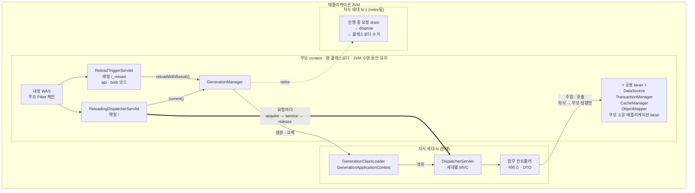

굵은 화살표가 업무 요청이 지나가는 길이다. 각 층에 들어 있는 것을 풀어 쓰면 다음과 같다.

```
┌─ 애플리케이션 JVM ────────────────────────────────────────────────────────────┐
│                                                                              │
│  부모 context  (SpringApplication이 만든 일반 Boot context, 앱 클래스로더)       │
│  ├─ 내장 Tomcat, DataSource, TransactionManager, CacheManager, ObjectMapper … │
│  ├─ 모든 Boot auto-configuration (DispatcherServlet/WebMvc/ErrorMvc만 제외)    │
│  ├─ 부모 소유 애플리케이션 bean (business-packages 밖, parent-packages 안)       │
│  ├─ 엔진 bean: ReloadLayout, GenerationManager, FullRestart                   │
│  └─ 서블릿:  "/"        → ReloadingDispatcherServlet                          │
│             "/_reload" → ReloadTriggerServlet (api/both 모드)                 │
│                    │ 요청마다 acquire / release                               │
│                    ▼                                                         │
│  자식 세대 N  (Generation = 클래스로더 + context + DispatcherServlet 한 벌)     │
│  ├─ GenerationClassLoader      업무 클래스만 child-first로 새로 로드            │
│  ├─ GenerationApplicationContext (parent = 부모 context)                      │
│  │   ├─ 업무 컨트롤러·서비스·DTO (business-packages 컴포넌트 스캔)               │
│  │   ├─ ChildWebMvcConfig / ChildMvcConfiguration  — 세대별 MVC                │
│  │   ├─ ChildInfrastructureConfiguration — AOP·트랜잭션·캐시·메서드 검증        │
│  │   └─ GenerationIntegration.configure()가 등록한 설정 (예: ProObject 실행 빈) │
│  └─ DispatcherServlet (서블릿 컨테이너에 등록하지 않고 엔진이 직접 호출)          │
│                                                                              │
│  자식 세대 N-1 (retire됨) — 진행 중 요청을 drain한 뒤 dispose, 클래스로더 수거    │
└──────────────────────────────────────────────────────────────────────────────┘
```

핵심 원칙 세 가지:

- **참조 방향은 자식 → 부모뿐이다.** 자식은 부모 bean을 주입받지만, 부모 bean·정적 캐시가 자식 클래스·인스턴스·
  람다를 보유하면 이전 세대의 클래스로더가 수거되지 않는다.
- **부분 교체가 안전하다고 판단한 변경만 세대 교체**하고, 나머지는 모두 전체 JVM 재시작으로 분류한다.
- **새 세대가 완전히 뜬 뒤에만 교체**한다. 실패하면 이전 세대가 계속 응답한다.

## 2. 실행 모드

| 설정 | 구조 | 변경 처리 |
|---|---|---|
| `reload.enabled=false` | 엔진 꺼짐. 일반 Spring Boot | 없음 |
| enabled, `business-packages` 비어 있음 (full-restart) | 일반 Boot MVC 유지. `GenerationManager`는 있지만 세대를 만들지 않음 | 모든 변경 → 전체 재시작 |
| enabled, `business-packages` 지정 (hybrid) | 부모 + 자식 세대 | 업무 변경 → 세대 교체, 그 외 → 전체 재시작 |

모드에 따라 달라지는 엔진 구성요소:

| 구성요소 | full-restart | hybrid |
|---|---|---|
| `ReloadLayout` 싱글턴 등록 | O | O |
| `ReloadParentTypeExcludeFilter` (부모 스캔에서 자식 클래스 제외) | X | O |
| 부모의 MVC auto-configuration 제외 | X | O |
| `ReloadingDispatcherServlet` (`/`) | X | O |
| `ReloadTriggerServlet` | `trigger.mode`가 `api`/`both`일 때 | 동일 |
| `ChangePoller` | `trigger.mode`가 `watch`/`both`일 때 | 동일 |
| `ProObjectGenerationIntegration` | X | ProObject HTTP 어댑터가 클래스패스에 있을 때 |

트리거 방식(`reload.trigger.mode`)은 모드와 독립이다. `watch`는 파일 폴링, `api`는 `POST /_reload`, `both`는 둘 다이며
어느 쪽이든 같은 `ChangePlanner`와 같은 baseline을 거쳐 `GenerationManager.reloadWithResult()`로 들어간다.

## 3. 부모 context와 자식 세대

### 부모 context

`SpringApplication`이 만든 원래 context다. 소비자의 `main` 코드는 바뀌지 않는다.

- **유지되는 것**: 내장 웹 서버, 커넥션 풀, 트랜잭션 매니저, 캐시 매니저, 보안 필터 체인, JPA/MyBatis,
  `ObjectMapper`, 부모 소유 애플리케이션 bean. 세대 교체 중에도 인스턴스 identity가 그대로다.
- **없는 것(hybrid)**: `DispatcherServlet`, Spring MVC 인프라, Boot 에러 MVC. 부모에 등록된 컨트롤러
  (라이브러리 제공, `parent-packages`)는 세대의 핸들러 매핑이 조상 context에서 찾아 처리한다.
- **엔진이 추가한 것**: `ReloadLayout`, `GenerationManager`, `FullRestart`, 서블릿 두 개.

### 자식 세대

`Generation` 객체 하나가 `GenerationClassLoader` + `GenerationApplicationContext` + `DispatcherServlet` 한 벌이다.

- context의 parent가 부모 context이므로 자식 bean은 부모 bean을 평소처럼 주입받는다.
- **Boot auto-configuration이 없다.** 필요한 인프라는 엔진이 매 세대에 직접 register한다
  (`ChildWebMvcConfig`, `ChildInfrastructureConfiguration`, 그리고 `GenerationIntegration`이 추가하는 설정).
- `DispatcherServlet`은 서블릿 컨테이너에 등록되지 않는다. 엔진이 합성 `ServletConfig`로 `init()`하고
  `ReloadingDispatcherServlet`이 `service()`를 직접 호출한다. `setPublishContext(false)`로 `ServletContext`
  attribute에 세대 context가 쌓이지 않게 한다.
- 세대 번호는 1부터 증가하며, 실패한 시도도 번호를 소모한다.

### 부모 → 자식에 전달되는 것과 전달되지 않는 것

| 부모의 것 | 자식에서의 취급 |
|---|---|
| 일반 bean (서비스, `DataSource`, `TransactionManager`, `CacheManager`) | 그대로 주입받아 사용 |
| `ObjectMapper` | 설정은 복사, 인스턴스는 `copy()`한 세대 전용 사본 사용 |
| `WebMvcRegistrations` | 세대마다 mapping/adapter/exception resolver를 새로 생성 |
| `WebMvcConfigurer` bean | 자식의 `DelegatingWebMvcConfiguration`이 조상까지 조회하므로 적용됨 |
| `@Aspect` bean | 적용됨 (advisor 인스턴스는 자식이 새로 만든다) |
| `Advisor` bean | **적용 안 됨** (`ChildAspectJAutoProxyCreator`가 차단) |
| `BeanPostProcessor` | **적용 안 됨** (BPP는 자기 factory의 bean만 처리) |
| 트랜잭션·캐시 advisor | 부모 것을 쓰지 않고 엔진이 자식에 `@EnableTransactionManagement`/`@EnableCaching`을 다시 켬 |
| `Filter`, `ServletContextInitializer` | 부모 것만 컨테이너에 등록됨. 자식에 정의하면 무시됨 |
| 이벤트 | 업무 코드가 발행한 이벤트는 부모로 전파. 세대 자신의 lifecycle 이벤트는 부모로 가지 않음 |

### 부모에 Spring MVC를 두지 않는 이유

MVC 인프라는 컨트롤러 클래스에 강하게 묶여 있어서, 부모에 두면 세대 교체도 안 되고 클래스로더 누수도 생긴다.
그래서 MVC는 통째로 자식 세대에 두고 부모에는 서블릿 컨테이너(Tomcat, 필터)만 남긴다.

1. **부모는 자식 bean을 볼 수 없다.** context 계층은 자식 → 부모 방향으로만 조회된다. 부모에
   `RequestMappingHandlerMapping`이 있어도 자식 세대의 컨트롤러를 찾지 못한다. 반대로 자식의 매핑은 부모
   컨트롤러를 찾을 수 있으므로, 지금 구조에서는 부모·자식 컨트롤러가 모두 처리된다.
2. **MVC 인프라는 컨트롤러 메타데이터를 캐시한다.** 핸들러 매핑의 등록 테이블, 어댑터의
   `@InitBinder`/`@ModelAttribute` 캐시, 예외 리졸버의 `@ExceptionHandler` 캐시, 메시지 컨버터의 `ObjectMapper`
   직렬화기 캐시가 모두 컨트롤러·DTO의 `Class`와 `Method`를 키로 잡는다. 부모에 있으면 이전 세대의 클래스로더를
   붙잡는다. 부모 `Advisor`를 자식에 적용하지 않는 것과 같은 이유다.
3. **세대를 원자적으로 교체하려면 MVC가 세대에 속해야 한다.** 핸들러 매핑은 초기화 때 한 번 핸들러를 탐색하므로,
   부모에 두면 교체 때마다 매핑을 지우고 다시 등록해야 하고 그 사이의 요청은 반쯤 바뀐 상태를 본다. 세대마다
   `DispatcherServlet`이 따로 있으면 참조 하나만 바꾸면 교체가 끝나고, 진행 중이던 요청은 이전 세대의 MVC에서
   그대로 끝난다.
4. **부모에 MVC가 남아 있으면 엔진과 충돌한다.** 부모의 `DispatcherServlet`은 `/` 매핑이
   `ReloadingDispatcherServlet`과 겹치고, `ErrorMvcAutoConfiguration`은 오류 처리를 부모가 가로채게 만든다.
   `ReloadAutoConfigurationImportFilter`가 이 세 개만 제외하는 이유다.

부모에서 빠지는 것은 MVC **실행 인프라**뿐이고 MVC **설정**은 부모 것을 그대로 쓴다. `ChildMvcConfiguration`이
부모의 `WebMvcRegistrations`와 `WebMvcConfigurer`를 읽어 세대마다 매핑·어댑터·리졸버를 새로 만들고,
`ObjectMapper`는 부모 설정을 `copy()`해서 쓴다. 대가는 세대마다 MVC 인프라를 다시 만드는 비용이며, 세대 교체
로그의 `refresh`/`dispatcher` 단계에 포함되어 나온다. full-restart 모드에서는 세대가 없으므로 부모에 일반 Boot
MVC가 그대로 있다.

### 재로딩 API가 컨트롤러가 아니라 서블릿인 이유

hybrid 모드의 부모에는 MVC가 없으므로, 컨트롤러는 부모에 두든 자식에 두든 `ReloadingDispatcherServlet` → 현재
세대의 `DispatcherServlet`을 거쳐야만 도달한다. 세대를 거치면 다음 문제가 생긴다.

1. **세대가 없으면 호출할 수 없다.** 첫 세대가 뜨기 전에는 `/_reload`도 503이 된다. 재로딩 API는 세대 상태와
   무관하게 호출할 수 있어야 한다.
2. **자기가 탄 세대를 자기가 교체한다.** 재로딩 요청이 세대 N을 acquire한 채 `reloadWithResult()`를 실행하면
   세대 N은 retire된 뒤에도 이 요청이 끝날 때까지 dispose되지 못한다. 매번 drain 경로를 타고, 응답 직렬화도
   퇴장 중인 세대의 MVC가 하게 된다.
3. **세대의 MVC 설정에 영향을 받는다.** 업무 코드의 인터셉터, `@ControllerAdvice`, 메시지 컨버터가 엔진 API에
   적용된다. 잘못된 업무 설정 때문에 재로딩 API가 깨지면 그 설정을 고친 코드를 반영할 통로가 막힌다.

`ReloadTriggerServlet`은 정확한 경로 매핑이라 `/`보다 우선하고 세대를 전혀 거치지 않는다. JSON을 Jackson 없이
직접 조립하는 것도 같은 이유다. full-restart 모드에서는 컨트롤러로도 동작하지만 모드마다 구현을 따로 두지 않으려고
서블릿 하나로 통일했다. 부모의 서블릿 필터(Spring Security 등)는 서블릿에도 그대로 적용된다.

## 4. 클래스 소유권과 클래스 로딩

### 소유권 규칙 (`layout/ClassOwnership`)

`isParentOwned(className)`은 중첩 클래스를 최상위 클래스 이름(`$` 앞)으로 바꾼 뒤 다음 중 하나면 `true`다.

1. `reload.parent-packages` 중 하나에 속한다.
2. 애플리케이션 클래스(`@SpringBootConfiguration`이 붙은 클래스)다.
3. `business-packages`가 지정돼 있는데 그중 어디에도 속하지 않는다.

즉 **기본은 부모**이고, `business-packages` 안에서 `parent-packages`와 애플리케이션 클래스를 뺀 것만 자식이다.
패키지 판정은 `className.startsWith(pkg + ".")`이므로 하위 패키지를 포함한다.

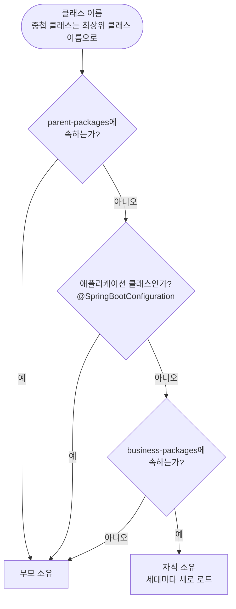

샘플(`sample-apps/greeting`)의 경우:

| 클래스 | 설정 | 소유 |
|---|---|---|
| `com.example.greeting.GreetingApplication` | 애플리케이션 클래스 | 부모 |
| `com.example.greeting.shared.GreetingService`, `DefaultGreetingService` | `parent-packages` | 부모 |
| `com.example.greeting.web.HelloController` | `business-packages` | 자식 |

### 자식 클래스패스 (`layout/ReloadLayout`)

`reload.classpath`를 지정하지 않으면 애플리케이션 클래스의 `CodeSource`가 가리키는 출력 디렉터리
(예: `build/classes/java/main`)를 쓴다. **이 디렉터리는 부모 클래스패스에도 그대로 있다.** 같은 `.class` 파일을
부모와 자식이 모두 볼 수 있으므로 "누가 로드하는가"를 소유권으로 갈라야 한다.

### 로딩 규칙 (`generation/GenerationClassLoader`)

`RestartClassLoader`(devtools에서 복사, child-first)를 상속하고 `loadClass`에 두 단계를 앞세운다.

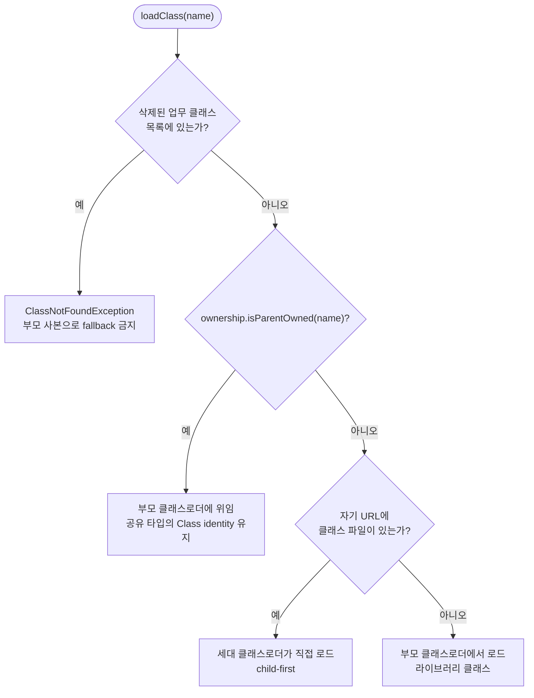

- 공유 타입(`GreetingService`)까지 child-first로 로드하면 부모와 다른 `Class`가 되어 주입·캐스팅이 실패한다.
  그래서 부모 소유 클래스는 반드시 부모에 위임한다.
- 라이브러리 클래스는 자식 URL에 없으므로 자연스럽게 부모에서 로드된다. **클래스의 로딩 위치와 bean의 소유는
  별개**다 — 부모 클래스로더가 로드한 라이브러리 클래스의 bean을 자식에 새로 만들 수 있다(ProObject 실행 빈).
- 삭제 fallback 금지가 필요한 이유: 부모 클래스패스에는 JVM 기동 시점의 사본이 캐시돼 있을 수 있어, 삭제한
  업무 클래스가 부모에서 "되살아나는" 것을 막아야 한다. `GenerationManager`가 지금까지 본 업무 클래스
  집합(`knownBusinessClasses`)에서 현재 스냅샷에 없는 것을 삭제 목록으로 넘긴다.

### 컴포넌트 스캔의 분할 (`ReloadLayout.isChildComponent`)

같은 판정 함수를 부모와 자식이 반대로 쓴다.

- 부모: `ReloadParentTypeExcludeFilter`가 `isChildComponent == true`인 클래스를 **제외**한다.
- 자식: `GenerationApplicationContext`의 스캐너가 `isChildComponent == false`인 클래스를 **제외**한다.

`isChildComponent`는 (1) 부모 소유가 아니고 (2) `@SpringBootConfiguration`이 아니며 (3) 리소스가 자식 클래스패스
**디렉터리 안의 파일**일 때만 `true`다. 그래서 스캔 패키지와 겹치는 라이브러리 JAR의 컴포넌트는 부모에만 등록된다.

자식의 스캔 범위는 `base-packages`(없으면 `@SpringBootApplication` 패키지)와 `business-packages`의 교집합으로
좁힌다(`GenerationManager.narrowToBusinessPackages`). 좁히지 않으면 부모 소유 클래스 파일까지 세대마다 읽고 버린다.

## 5. 부트스트랩 순서

여러 파일과 Spring 확장점에 걸쳐 있다.

| 단계 | 시점 | 클래스 | 하는 일 |
|---|---|---|---|
| 1 | `ApplicationPreparedEvent` (부모 refresh 전) | `autoconfigure/ReloadApplicationListener` (`spring.factories`) | `reload.*`를 바인딩하고 `ReloadLayout`을 결정해 싱글턴으로 등록. hybrid면 `ReloadParentTypeExcludeFilter`도 등록 |
| 2 | auto-configuration import 선별 | `autoconfigure/ReloadAutoConfigurationImportFilter` (`spring.factories`) | hybrid일 때만 `DispatcherServletAutoConfiguration`, `WebMvcAutoConfiguration`, `ErrorMvcAutoConfiguration` 제외 |
| 3 | 부모 컴포넌트 스캔 | `layout/ReloadParentTypeExcludeFilter` | 자식 소유 컴포넌트를 부모에 등록하지 않음 |
| 4 | auto-configuration 처리 | `autoconfigure/ReloadAutoConfiguration` | `FullRestart`(`SupervisedRestart`), `GenerationManager`, 서블릿 등록 bean 정의 |
| 4' | 〃 | `autoconfigure/ProObjectReloadAutoConfiguration` | ProObject가 있고 hybrid면 통합 bean과 dispatcher bridge 등록 |
| 5 | `GenerationManager` 생성자 | `generation/GenerationManager` | `ChangePlanner` 생성, 첫 baseline 스냅샷 촬영, drain 스케줄러 생성 |
| 6 | `ApplicationReadyEvent` | `GenerationManager.onApplicationReady` | watch 모드면 `ChangePoller` 시작 → hybrid면 첫 세대 생성. 실패하면 예외로 기동 중단 |

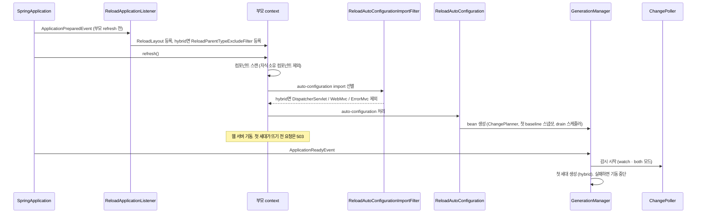

표의 2·3단계는 확장점별로 나열한 것이고, 실제 실행은 그림처럼 부모 컴포넌트 스캔이 auto-configuration import
선별보다 먼저다(Spring은 auto-configuration을 설정 클래스 파싱의 마지막에 지연 처리한다).

1단계가 auto-configuration이 아니라 `ApplicationListener`인 이유는 컴포넌트 스캔이 refresh 초반에 일어나서
auto-configuration으로는 이미 늦기 때문이다. 6단계에서 감시를 먼저 시작하는 이유는 첫 로드와 감시 시작 사이의
변경을 놓치지 않기 위해서다.

웹 서버는 부모 refresh가 끝날 때(6단계 전에) 이미 요청을 받기 시작하므로, 첫 세대가 뜨기 전에 들어온 요청은
503을 받는다.

## 6. 요청 처리 흐름

### HTTP 요청

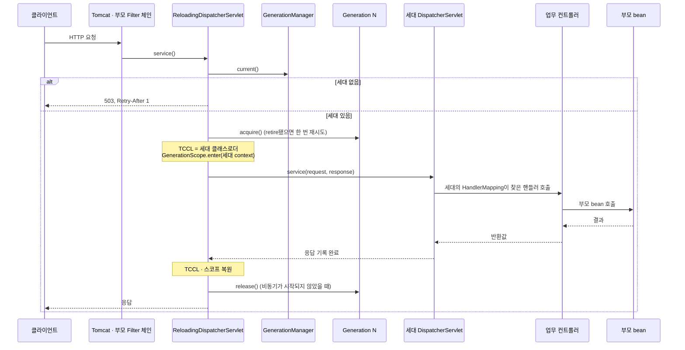

- **요청 하나는 끝까지 한 세대에서 처리된다.** 처리 도중 세대가 교체돼도 그 요청은 이전 세대에서 끝나고,
  마지막 요청이 `release()`되는 순간 이전 세대가 dispose된다.
- **비동기 요청**: `request.isAsyncStarted()`면 세대를 요청 attribute에 저장하고 `AsyncListener`를 건다.
  `ASYNC` 재디스패치는 attribute의 세대로 이어서 처리하고, `onComplete`에서 한 번만 release한다.
- `/_reload`는 정확한 경로 매핑이라 `/`보다 우선하며, 세대를 거치지 않는다. 세대가 없거나 실패한 상태에서도
  호출할 수 있다.

### HTTP 외의 진입점

`GenerationManager.withGeneration(operation)`이 같은 일을 한다: 현재 세대를 acquire하고 TCCL과
`GenerationScope`를 설정한 뒤 동기 호출이 끝나면 release한다. 이미 같은 부모의 세대가 스코프에 고정돼 있으면
(중첩 호출) 그 세대를 재사용한다. 그래서 요청 중에 세대가 교체돼도 중첩된 호출은 처음 고정한 세대를 본다.
스코프는 `ThreadLocal`이며 **다른 스레드(executor)로 자동 전파되지 않는다.**

## 7. 변경 감지와 분류

### 스냅샷 (`watch/ChangePlanner.snapshot`)

감시 대상 root는 세 곳의 합집합이다.

1. `ReloadLayout.classpath()` — 자식 클래스패스
2. `java.class.path`의 디렉터리와 JAR — 실행 클래스패스 전체(다중 모듈 출력, 리소스 디렉터리, 의존성 JAR)
3. `reload.watch-paths` — 빌드 파일, 외부 설정, ProObject 서비스 XML 등

파일마다 `Entry(digest, className, infrastructure)`를 만든다.

| 파일 | digest | className | infrastructure |
|---|---|---|---|
| `*.jar` | `크기:수정시각` (내용 해싱 안 함) | `null` | `true` |
| `*.class` | SHA-256 | ASM으로 읽은 이름 | 아래 규칙 |
| 그 외(리소스·설정) | SHA-256 | `null` | `true` |

`.class`가 `infrastructure=true`가 되는 경우:

- 자식 클래스패스 디렉터리 밖에 있다.
- ASM으로 읽지 못한다(불완전하게 쓰인 파일, 지원하지 않는 형식).
- 클래스나 메서드에 다음 애너테이션이 있다: `@Enable*`, `@Configuration`, `@ConfigurationProperties`, `@Bean`,
  `jakarta.persistence.*`/`javax.persistence.*`, `org.springframework.data.*`, MyBatis 애너테이션, `@Repository`,
  `@Scheduled`/`@Schedules`, `@KafkaListener`/`@RabbitListener`/`@JmsListener`.
- 다음 인터페이스를 직접 구현한다: `*BeanPostProcessor`, `*BeanFactoryPostProcessor`, `*ServletContextInitializer`,
  `*WebMvcConfigurer`, `jakarta.servlet.Filter`, `jakarta.servlet.Servlet`, `Advisor`.

클래스는 **로드하지 않고** 바이트코드만 읽는다. 크기와 수정 시각이 이전과 같은 파일은 이전 `Entry`를 재사용하되,
읽은 시점 기준 3초 이내에 쓰인 파일은 항상 다시 읽는다(파일시스템 시각 해상도 대비). `exclude-patterns`
(Ant 스타일, root 기준 상대 경로)에 맞는 파일은 스냅샷에 넣지 않는다. 경로는 `toRealPath()`로 정규화해
Windows 8.3 짧은 이름이나 심볼릭 링크로 같은 디렉터리가 두 번 잡히는 것을 막는다.

### 분류 (`ChangePlanner.plan`)

baseline과 candidate에서 `Entry`가 달라진 경로마다:

- full-restart 모드이거나, 이전/이후 `Entry` 중 하나라도 `className == null` 또는 `infrastructure` 또는
  부모 소유 클래스면 → **RESTART**
- 아니면 → **RELOAD**

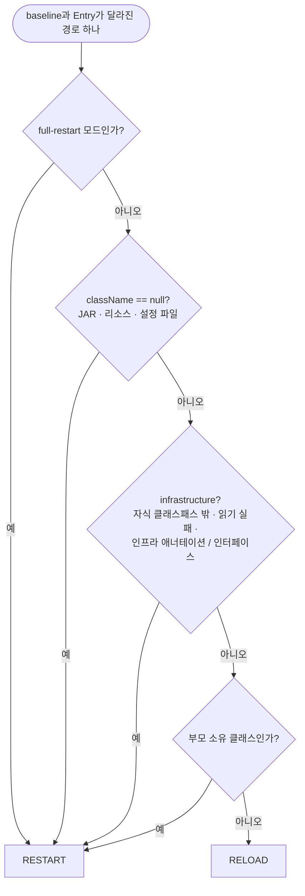

이전·이후 `Entry` 양쪽에 같은 판정을 적용하므로, 인프라였던 클래스가 일반 클래스로 바뀐 경우도 RESTART다.

하나라도 RESTART면 전체가 RESTART다(혼합 변경은 부분 적용하지 않는다). 달라진 것이 없으면 NONE.
`reasons`에는 `business: <path>` / `infrastructure: <path>`가 쌓여 API 응답과 로그에 나온다.

### 폴링 (`watch/ChangePoller`)

`reload-watch` 데몬 스레드가 `poll-interval`마다 스냅샷을 찍는다. 스냅샷이 바뀌면 시각을 기록하고,
**`quiet-period` 동안 더 바뀌지 않았을 때만** 한 번 전달한다. 전달한 스냅샷은 `delivered`로 기억하므로 같은
변경이 실패했다고 무한 재시도하지 않는다 — 파일이 다시 바뀌어야 다음 시도가 일어난다.

quiet-period는 "빌드 완료"를 보장하지 않는다. 대규모 증분 빌드는 컴파일 후 `POST /_reload`를 호출하는 api
모드가 안전하다.

## 8. 세대 교체 절차

진입점은 `GenerationManager.reloadWithResult()` 하나이고 `synchronized`다. 감시(`onStableChange`), API
(`ReloadTriggerServlet`), 애플리케이션 코드 어디서 호출해도 동시에 하나만 실행된다.

트리거에서 결과까지의 갈림길:

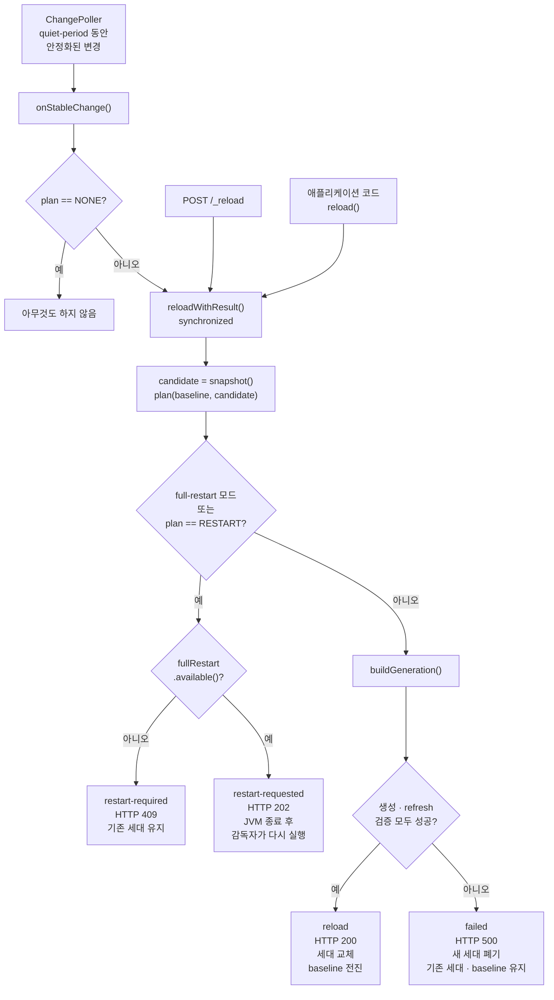

새 세대를 만들어 교체하는 순서(`buildGeneration`):

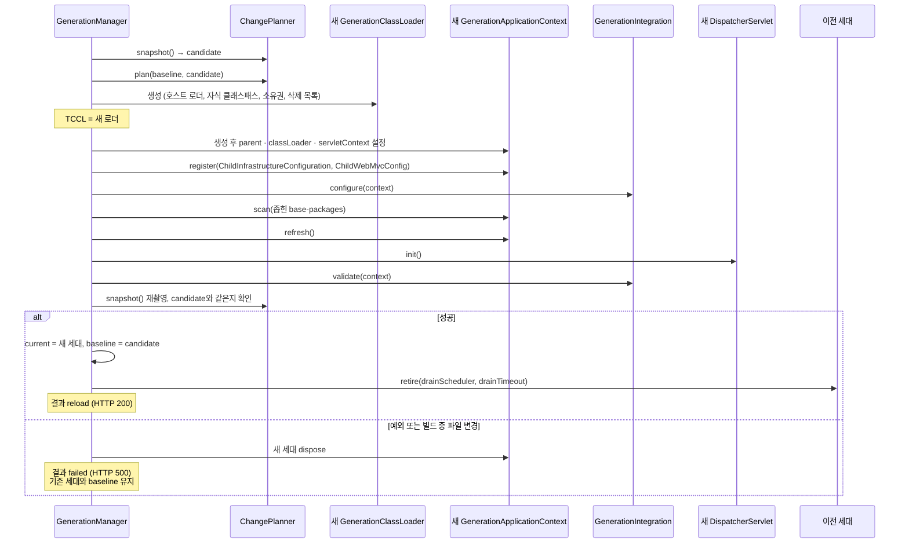

같은 절차를 단계별로 풀어 쓰면 다음과 같다.

```
reloadWithResult()
 1. 종료 중이면 실패 반환
 2. candidate = changePlanner.snapshot()            ← 읽기 실패 시 기존 상태 유지 + 오류
 3. plan = changePlanner.plan(baseline, candidate)
 4. full-restart 모드 또는 plan == RESTART
      ├ fullRestart.available() == false → "restart-required" (HTTP 409), 기존 세대 유지
      └ fullRestart.request()            → "restart-requested" (HTTP 202)
 5. 그 외 → buildGeneration(candidate, reasons)

buildGeneration()
 a. (최초 1회) 클래스패스 존재 확인, BoundaryChecker, 부모 설정 배치 검사 — 모두 경고만
 b. 삭제된 업무 클래스 = knownBusinessClasses − candidate의 업무 클래스
 c. new GenerationClassLoader(hostClassLoader, layout.classpathUrls(), ownership, deleted)
 d. TCCL을 새 로더로 바꾸고
      createContext(): parent·classLoader·servletContext 설정
                       → ChildInfrastructureConfiguration, ChildWebMvcConfig register
                       → 모든 GenerationIntegration.configure(context)
                       → 좁힌 base-packages scan
      context.refresh()
      createDispatcher(): DispatcherServlet.init()
      모든 GenerationIntegration.validate(context)
      스냅샷을 다시 찍어 candidate와 같은지 확인      ← 빌드 중 변경이면 공개하지 않음
 e. 실패(Exception | LinkageError)
      → failedReloads++, 새 세대 dispose, 기존 세대와 baseline 유지, "failed" (HTTP 500)
 f. 성공
      → 자식 설정 배치 검사(경고)
      → current.getAndSet(새 세대), baseline = candidate, knownBusinessClasses 갱신
      → 이전 세대 retire(drainScheduler, drainTimeout)
      → "reload" (HTTP 200)
```

알아 둘 점:

- **변경이 없어도(NONE) hybrid에서 명시적으로 호출하면 세대를 다시 만든다.** 감시 경로(`onStableChange`)는
  NONE이면 아무것도 하지 않는다.
- baseline은 **성공했을 때만** 전진한다. 실패 후 소스를 고치면 다음 시도는 여전히 같은 baseline과 비교한다.
- 성공 로그 `Generation N started in X ms [...]`에 단계별 시간이 붙는다: `refresh`(그 안에 `scan`,
  `factoryPostProcessors`, `beanPostProcessors`, `singletons`), `dispatcher`, `verify`.
- 실패 원인은 가장 안쪽 원인의 클래스 이름과 메시지 **문자열**로만 남긴다. 예외 객체는 스택으로 자식 클래스를
  붙잡기 때문이다.

### 이전 세대의 퇴장 (`Generation.retire` → `dispose`)

1. `retired = true`. 이후 `acquire()`는 `false`를 돌려주므로 새 요청은 들어오지 않는다.
2. 진행 중 요청이 0이면 즉시 dispose. 있으면 마지막 `release()`에서 dispose되고, `drain-timeout`이 지나면
   `reload-drain` 스레드가 강제로 dispose한다.
3. dispose는 한 번만 실행된다: dispatcher `destroy()` → context `close()` → `GenerationCacheCleaner` →
   클래스로더 `close()`(JAR 핸들 해제, Windows 파일 잠금 방지) → 필드 참조 모두 `null`.

세대 하나의 상태 변화:

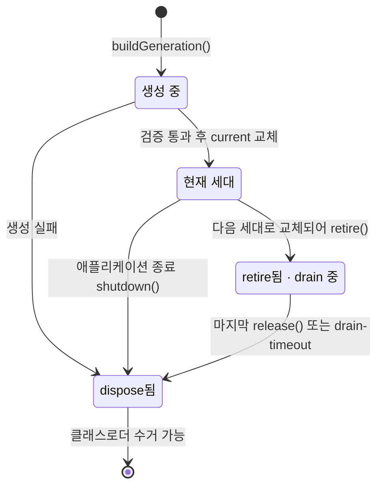

교체 시점에 처리 중이던 요청과 그 뒤에 들어온 요청이 서로 다른 세대에서 끝나는 모습:

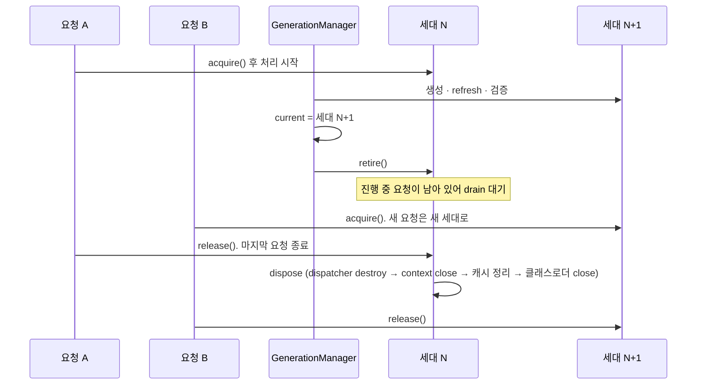

`Generation` 객체가 어딘가에 남아 있어도 dispose 후에는 클래스로더·context·dispatcher 참조를 놓으므로
자식 클래스로더가 수거될 수 있다.

## 9. 전체 재시작 절차

감독자와 애플리케이션 JVM은 요청 파일 하나로만 신호를 주고받는다.

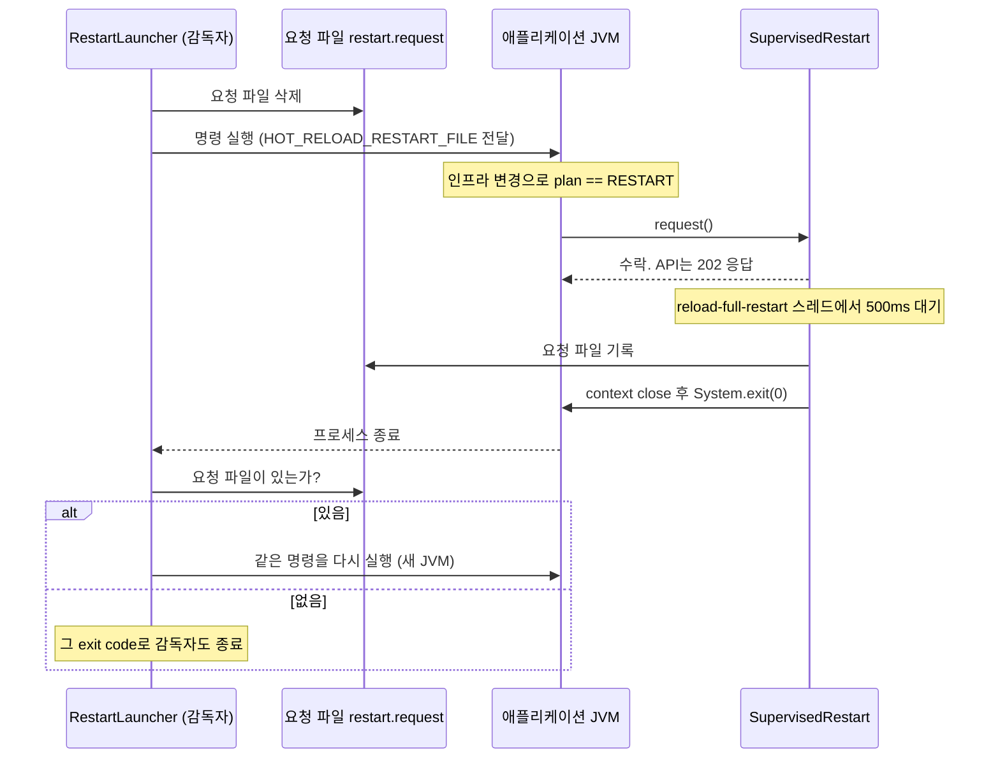

감독자 쪽 루프:

```
RestartLauncher -- <명령> [인자...]
  loop:
    요청 파일 삭제
    명령 실행 (환경 변수 HOT_RELOAD_RESTART_FILE=<임시 디렉터리>/restart.request, inheritIO)
    종료 대기
    요청 파일이 없으면 → 그 exit code로 감독자도 종료   (기동 실패를 무한 재시도하지 않음)
    요청 파일이 있으면 → 같은 명령을 다시 실행
```

애플리케이션 쪽(`SupervisedRestart.request()`):

1. 환경 변수가 있고 그 부모 디렉터리가 존재할 때만 `available() == true`.
2. 중복 요청은 `AtomicBoolean`으로 한 번만 수락한다.
3. `reload-full-restart` 스레드에서 500ms 뒤(API가 202를 쓸 시간) 요청 파일을 쓰고 → context를 닫고 →
   `System.exit(0)`. 요청 파일을 쓰지 못하면 종료하지 않고 계속 실행한다.

감독자는 명령을 셸 문자열로 합치지 않고 인자 배열 그대로 `ProcessBuilder`에 넘긴다. Gradle `bootRun` 같은
빌드 명령을 감독하면 재시작 때 의존성 그래프와 빌드 설정도 다시 해석된다. 고정 `java -cp` 명령은 같은
클래스패스만 재사용한다. 감독자 종료 시 shutdown hook이 자신이 시작한 프로세스와 그 자손만 종료한다.

감독자 없이(`bootRun` 직접 실행) 인프라가 바뀌면 프로세스를 죽이지 않고 409 `restart-required`를 돌려주며
기존 세대를 유지한다. 임베딩 환경(외부 JEUS 등)은 `FullRestart` bean을 직접 제공해 재시작 동작을 대체한다.

## 10. 핵심 클래스 상세

패키지 사이의 의존 방향(화살표는 "사용한다"):

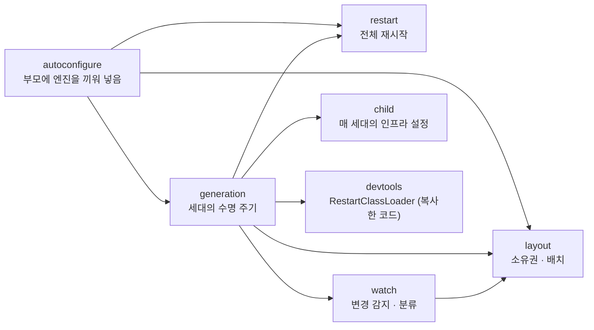

### 10.1 루트

**`ReloadProperties`** — `@ConfigurationProperties("reload")`

| 프로퍼티 | 기본값 | 의미 |
|---|---|---|
| `enabled` | `true` | 엔진 사용 여부 |
| `business-packages` | 비어 있음 | 세대 교체 대상 패키지. 비면 full-restart 모드(`isHybrid() == false`) |
| `parent-packages` | 비어 있음 | 업무 영역 안에서도 부모에 유지할 패키지 |
| `classpath` | 애플리케이션 클래스의 출력 디렉터리 | 자식 클래스로더 URL(디렉터리/JAR). 상대 경로는 작업 디렉터리 기준 |
| `base-packages` | `@SpringBootApplication` 패키지 | 자식 컴포넌트 스캔 범위(업무 패키지와의 교집합으로 좁혀짐) |
| `watch-paths` | 비어 있음 | 클래스패스 밖에서 추가로 감시할 파일·디렉터리 |
| `trigger.mode` | `watch` | `watch` / `api` / `both` |
| `trigger.api-path` | `/_reload` | 재로딩 API 경로 |
| `poll-interval` | `1s` | 스냅샷 주기 |
| `quiet-period` | `400ms` | 변경이 멈춘 뒤 대기 시간 |
| `drain-timeout` | `30s` | 이전 세대의 진행 중 요청 대기 한도 |
| `exclude-patterns` | `**/*.log` | 변경으로 치지 않을 Ant 패턴 |
| `placement-check.enabled` | `true` | 설정 배치 규칙 경고 |
| `placement-check.allowed-child-annotations` | 비어 있음 | 자식 설정에 추가로 허용할 `@Enable*` |

`ReloadApplicationListener`, `ReloadAutoConfigurationImportFilter`, 두 `Condition`은 bean 주입이 불가능한
시점에 동작하므로 `Binder`로 이 클래스를 직접 바인딩한다.

### 10.2 `autoconfigure` — 부모에 엔진을 끼워 넣는 층

| 클래스 | 역할 |
|---|---|
| `ReloadApplicationListener` | 부모 refresh 전 `ReloadLayout`을 결정·등록하고(hybrid면) 부모 스캔 필터를 등록한다. 웹 context가 아니거나 `enabled=false`면 아무것도 하지 않는다. |
| `ReloadAutoConfigurationImportFilter` | hybrid일 때 부모의 `DispatcherServlet`/`WebMvc`/`ErrorMvc` auto-configuration 세 개를 걸러 낸다. 소비자가 `exclude`를 직접 쓰지 않아도 된다. |
| `ReloadAutoConfiguration` | 서블릿 웹 앱이고 `enabled`일 때 활성. `FullRestart`(`@ConditionalOnMissingBean`), `GenerationManager`, `ReloadingDispatcherServlet` 등록(`/`, loadOnStartup=1, asyncSupported), `ReloadTriggerServlet` 등록을 정의한다. |
| `OnHybridCondition` | `business-packages`가 비어 있지 않을 때만 일치. |
| `OnReloadApiCondition` | `trigger.mode`가 `api`/`both`일 때만 일치. |
| `ProObjectReloadAutoConfiguration` | `ProObjectHttpHandlerAdapter`가 클래스패스에 있고 hybrid일 때 활성. `ProObjectGenerationIntegration` bean과, 부모 `proObjectDispatcher`를 감싸 `dispatch` 호출을 `withGeneration`으로 현재 세대의 dispatcher에 위임하는 `BeanPostProcessor`를 등록한다. 클래스 이름 문자열로만 검사하므로 엔진에 ProObject 의존성이 없다. |

### 10.3 `layout` — 무엇이 누구 것인가

| 클래스 | 역할 |
|---|---|
| `ReloadLayout` | 부모가 만들어질 때 한 번 정해지는 배치: 자식 클래스패스(`classpath()`, `classpathUrls()`, `watchedDirectories()`)와 `ClassOwnership`. 부모 스캔 필터와 `GenerationManager`가 **같은 인스턴스**를 공유한다. 자식 클래스패스에 엔진 자신이 들어 있으면 경고한다(엔진 타입이 세대마다 따로 로드되어 주입·캐스팅이 깨진다). |
| `ClassOwnership` | 4장의 소유권 판정. `classNameOf(resourcePath)` 유틸리티도 제공한다. |
| `ReloadParentTypeExcludeFilter` | Boot의 `TypeExcludeFilter` 확장점. `@SpringBootApplication`의 컴포넌트 스캔이 이 bean에 제외 여부를 묻는다. |
| `BoundaryChecker` | **보조 진단.** 부모 소유 클래스 파일의 상수 풀(클래스 참조, 필드·메서드 서술자)을 읽어 자식 소유 클래스를 참조하는지 찾는다. 같은 소스 세트 안에서는 컴파일러가 막지 못하는 위반이다. 첫 세대 생성 때 한 번 경고만 남긴다. 리플렉션·문자열 기반 참조는 잡지 못한다. |
| `ConfigurationPlacementChecker` | **보조 진단.** 설정 배치 규칙 위반을 경고한다. `findChildViolations`: 자식 `@Configuration`의 허용되지 않은 `@Enable*`/`@Import`, 자식에 정의된 인프라 bean(`Filter`, `DataSource`, `SecurityFilterChain`, `CacheManager`, `ApplicationRunner` 등), Advisor·BPP가 아닌 `@Bean`. `findParentOnlyFeatures`: 부모에 선언되어 자식 bean에는 적용되지 않는 `@EnableAsync`, `@EnableScheduling`, `Advisor` bean. 위반하면 오류 없이 기능만 빠지므로 경고가 유일한 단서다. |

### 10.4 `generation` — 세대의 수명 주기

**`GenerationManager`** — 부모 bean, 엔진의 중심

- 상태: `current`(AtomicReference), `baseline`(마지막으로 적용된 스냅샷), `knownBusinessClasses`,
  `draining`(retire됐지만 아직 dispose되지 않은 세대), `failedReloads`, 세대 번호 카운터.
- 공개 API

  | 메서드 | 용도 |
  |---|---|
  | `reload()` / `reloadWithResult()` | 분류 후 세대 교체 또는 전체 재시작 요청 |
  | `withGeneration(op)` | 비 HTTP 진입점에서 세대 고정 |
  | `currentGenerationId()` | 현재 세대 번호(없으면 0) |
  | `failedReloads()`, `triggerMode()`, `strategy()`, `restartAvailable()` | 상태 조회(`GET /_reload`가 사용) |

- `@PreDestroy shutdown()`: 감시 중단 → 현재 세대 dispose → drain 스케줄러 종료 → drain 중이던 세대도 즉시 dispose.

**`Generation`** — 클래스로더 + context + dispatcher 한 벌과 참조 카운트

- `acquire()`는 **먼저 증가시키고 나서** `retired`를 확인한다. 반대 순서면 "확인 → retire → 즉시 dispose → 증가"가
  끼어들어 dispose된 세대로 요청이 들어갈 수 있다.
- `release()`는 카운트가 0이 되고 retire 상태면 스스로 dispose한다.

**`GenerationClassLoader`** — 4장 참고.

**`GenerationApplicationContext`** — `AnnotationConfigWebApplicationContext` 확장

- 스캐너에 `!layout.isChildComponent(...)` 제외 필터를 추가한다. `@SpringBootApplication` 클래스가 자식에
  등록되면 자식에서 auto-configuration과 스캔이 다시 일어나므로 반드시 빠져야 한다.
- `GenerationAutowireCandidateResolver`를 설치한다.
- **자신의 lifecycle 이벤트(`ContextRefreshedEvent`, `ContextClosedEvent` 등)를 부모로 보내지 않는다.** 부모에는
  출처를 확인하지 않고 이를 애플리케이션 전체의 기동·종료로 처리하는 리스너가 있을 수 있다(예: JEUS starter의
  `JEUSFinalizer`가 `ContextClosedEvent`에 TM 서버를 내린다). 업무 코드가 발행한 이벤트는 그대로 부모에도 간다.
- refresh 단계별 소요 시간을 기록한다(`phases()`).

**`GenerationAutowireCandidateResolver`**

Spring은 자식 factory에 없는 후보를 부모 factory로 넘기면서 **자식의 resolver를 그대로** 쓴다. 자식 resolver는
부모의 scoped proxy가 가리키는 `scopedTarget.*` 정의를 찾지 못해 제네릭 정보가 없는 타입을 부모의 merged bean
definition에 캐시하고, 그 결과 부모가 나중에 같은 제네릭 타입 후보 중 엉뚱한 bean을 주입한다(예: ProObject 22의
`@RefreshScope` `Map<String, Boolean>`). 이 resolver는 bean 정의를 가진 factory를 조상 방향으로 찾아 **그
factory의 resolver에게 판단을 맡긴다.**

**`GenerationScope`** — 동기 호출 체인에 세대 context를 고정하는 `ThreadLocal` + `AutoCloseable`. 중첩 진입 시
이전 값을 복원한다.

**`ReloadingDispatcherServlet`** — 6장 참고. 부모에 `/`로 등록되는 유일한 요청 진입 서블릿.

**`ReloadTriggerServlet`** — 재로딩 API

| 요청 | 응답 |
|---|---|
| `POST` | `reloadWithResult()` 실행. `action`에 따라 200(`reload`) / 202(`restart-requested`) / 409(`restart-required`) / 500(`failed`). 본문: `reloaded`, `generation`, `previousGeneration`, `durationMillis`, `failedReloads`, `error`, `action`, `reasons` |
| `GET` | `mode`, `strategy`, `restartAvailable`, `generation`, `failedReloads` |

Jackson을 쓰지 않고 JSON을 직접 조립한다(엔진은 Jackson을 `compileOnly`로만 가진다). 인증이 없으므로 개발
환경에서만 노출한다.

**`ReloadResult`** — 한 번의 재로딩 결과 record. 오류는 문자열로만 담는다.

**`GenerationCacheCleaner`** — 세대 dispose 뒤 JVM 전역 캐시 정리. 12장 참고.

**`GenerationIntegration`** — 세대별 확장 계약. 11장 참고.

**`ProObjectGenerationIntegration`** — ProObject 22 실행 빈의 세대별 재구성

- `configure`: `BeanFactoryPostProcessor`를 추가해, 부모에 있는 실행 빈 17종(`beanClassLoaderHolder`,
  `objectFactory`, `componentApplicationContext`, `proObjectDispatcher`, 각 서비스 핸들러, `serviceManager`,
  인터셉터·aspect 등)의 **`@Bean` 정의를 복제**해 자식에 singleton·non-lazy로 등록한다. 인스턴스가 아니라 정의를
  복제하므로 factory method의 `ApplicationContext`·클래스로더 의존성이 자식에서 다시 해석된다. scoped proxy인
  경우 `scopedTarget.*` 정의를 원본으로 쓰고 proxy의 주입 속성(primary 등)을 따른다.
- `validate`: `beanClassLoaderHolder`, `objectFactory`, `proObjectDispatcher`가 자식의 로컬 bean인지,
  `requestMappingHandlerAdapter`가 `ProObjectHttpHandlerAdapter` 계열인지 확인한다. 아니면 세대를 공개하지 않는다.
- 서버, `ApplicationManager`, 메타, 연결 풀은 부모에 유지한다.

*왜 필요한가.* ProObject starter는 부모에서 auto-configuration으로 뜨고, 실행 빈 일부는 생성 시점에
`ApplicationContext`와 클래스로더를 잡아 둔다. 부모 인스턴스를 그대로 쓰면 자식 세대의 업무 컨트롤러·DTO를 찾지
못하고, 찾게 만들더라도 파서·객체 팩터리 캐시가 부모 인스턴스에 쌓여 이전 세대 클래스로더를 붙잡는다. 그렇다고
ProObject 전체를 자식으로 옮길 수는 없으므로(서버·메타·연결 풀은 유지 인프라) 실행에 관여하는 빈만 세대에 다시
만든다. ProObject 어댑터 자체는 이 클래스가 아니라 `ChildMvcConfiguration`이 부모의 `WebMvcRegistrations`를 통해
세대마다 받아 온다.

*같은 이름의 빈이 부모와 자식에 함께 존재한다.* 실행 빈 17개는 부모와 각 세대에 서로 다른 인스턴스로 있고,
부모 것은 지워지지 않는다. context 계층은 자기 factory를 먼저 보고 없을 때만 부모로 올라가므로 자식의 정의가
부모의 같은 이름을 가린다.

| 조회하는 쪽 | 얻는 인스턴스 |
|---|---|
| 자식 세대의 bean (업무 컨트롤러, 세대의 실행 빈끼리) | 자식 것 |
| 부모의 bean (서버, `ApplicationManager` 등 유지 인프라) | 부모 것 (부모는 자식을 볼 수 없다) |

- 타입 주입에서도 같은 이름이면 자식 정의가 부모 후보를 대체하므로 자식 안에서 후보 중복은 생기지 않는다.
- `validate`가 `containsLocalBean`으로 검사하는 이유다. `containsBean`은 부모 것만 있어도 `true`다.
- 부모 인스턴스는 부모 쪽 ProObject 인프라가 계속 참조한다. 이 중 `proObjectDispatcher`만
  `ProObjectReloadAutoConfiguration`의 bridge가 프록시로 감싸 `dispatch`를 현재 세대의 dispatcher로 넘긴다.
  세대가 아직 없으면(세대 번호 0) 부모 것이 그대로 처리한다.
- **나머지 16개의 부모 인스턴스에는 bridge가 없다.** 부모 인프라가 dispatcher를 거치지 않고 이들을 직접 호출하는
  경로가 있다면 부모 기준으로 동작한다. 그런 경로의 존재 여부는 ProObject 내부 코드에 달려 있고 엔진 쪽에서
  확인된 바 없다(미검증).

부수 효과:

- 실행 빈이 부모에 한 벌, 세대마다 한 벌 생긴다. 세대 것은 세대와 함께 dispose된다.
- 부모 빈이 `@RefreshScope`여도 자식에는 원래 이름의 일반 singleton 하나만 생긴다. 자식 쪽 실행 빈은 refresh
  scope의 갱신 대상이 아니다.
- 소비자가 업무 패키지에 같은 이름의 bean을 정의하면 `configure`가 예외를 던져 세대가 뜨지 않는다.
- 이름 목록(`EXECUTION_BEANS`)이 하드코딩이라 ProObject 22의 표준 `@Bean` 이름과 factory method 계약에 의존한다.
  소비자가 이 빈들을 다른 이름·방식으로 교체했다면 맞지 않는다.

### 10.5 `child` — 매 세대에 register되는 인프라

자식에는 auto-configuration이 없으므로 이 패키지가 그 역할을 한정적으로 대신한다. **소비자가 `com.example.reload`
패키지를 컴포넌트 스캔하면 안 된다** — 이 설정들이 부모에 등록되면 부모에도 MVC가 켜진다.

| 클래스 | 역할 |
|---|---|
| `ChildWebMvcConfig` | `ChildMvcConfiguration`을 import하고 메시지 컨버터를 구성한다. JSON 컨버터는 **부모 `ObjectMapper`의 `copy()`**를 쓴다. (역)직렬화기 캐시가 `ObjectMapper` 인스턴스에 붙어 있어, 부모 인스턴스를 그대로 쓰면 자식 DTO용 직렬화기가 부모에 남아 이전 클래스로더를 붙잡는다. |
| `ChildMvcConfiguration` | `DelegatingWebMvcConfiguration` 확장. 부모의 `WebMvcRegistrations`가 있으면 그것이 주는 mapping/adapter/exception resolver를 세대마다 새로 받아 쓴다(ProObject 어댑터가 이 경로로 들어온다). 핸들러 매핑은 조상 context의 컨트롤러도 탐색한다. |
| `ChildInfrastructureConfiguration` | AOP 인프라. (1) `ChildAutoProxyCreatorRegistrar`가 AspectJ가 있으면 auto-proxy creator를 등록하거나 이미 등록된 것을 `ChildAspectJAutoProxyCreator`로 **교체**한다(`spring.aop.auto`, `spring.aop.proxy-target-class` 존중, 기본은 클래스 프록시). (2) 부모에 `TransactionManager`가 있으면 `@EnableTransactionManagement`. (3) 부모에 캐시 인터셉터가 있으면 `@EnableCaching`. (4) `jakarta.validation.Validator`가 클래스패스에 있으면 `MethodValidationPostProcessor`. 트랜잭션 매니저와 `CacheManager` 자체는 부모 bean을 쓴다. `@Async`, `@Scheduled`는 켜지 않는다. |
| `ChildAspectJAutoProxyCreator` | `isEligibleAdvisorBean`에서 **자식 factory에 정의된 advisor만** 허용한다. 부모 `Advisor` 인스턴스가 자식 bean에 적용되면 메서드별 메타데이터 캐시가 부모 쪽 인스턴스에 쌓여 누수가 된다. 부모의 `@Aspect` bean은 advisor 인스턴스를 자식이 새로 만들기 때문에 그대로 적용한다. |
| `AncestorLookup` | 성능용 bean factory 뷰(JDK 프록시). Spring의 `beanNamesForTypeIncludingAncestors`는 부모 빈 수의 제곱에 비례하는데, 세대는 `@Aspect`·`@ControllerAdvice`·핸들러를 찾을 때마다 이 경로를 탄다. 이 뷰는 `getBeanNamesForType`에서 조상 이름을 선형 시간에 직접 합치고 `getParentBeanFactory()`는 `null`을 돌려줘 Spring이 다시 병합하지 않게 한다. 결과(가까운 factory의 로컬 빈이 조상을 가림)는 동일하다. 세대 객체만 참조하고 세대와 함께 사라진다. |

`ChildMvcConfiguration` 안의 보조 클래스:

- `AncestorAwareRequestMappingHandlerMapping`, `AncestorAwareExceptionHandlerExceptionResolver` — 엔진이 직접
  만드는 경우 `AncestorLookup`으로 후보를 구한다.
- `ControllerAdviceLookupPostProcessor` — `RequestMappingHandlerAdapter`는 `WebMvcRegistrations`가 만든 하위
  클래스일 수 있어 상속으로 끼어들 수 없다. 초기화 동안만 `ApplicationObjectSupport.applicationContext` 필드를
  리플렉션으로 뷰로 바꿨다가 되돌린다. 필드를 찾지 못하면 Spring 기본 경로를 쓴다.

### 10.6 `watch` — 변경 감지

| 클래스 | 역할 |
|---|---|
| `ChangePlanner` | 스냅샷 촬영과 분류(7장). 감시·API·직접 호출이 **하나의 인스턴스**를 공유한다. 캐시는 문자열만 담아 클래스를 붙잡지 않는다. |
| `ChangePoller` | quiet-period 기반 안정화 후 한 번 전달(7장). |

### 10.7 `restart` — 전체 재시작

| 클래스 | 역할 |
|---|---|
| `FullRestart` | 전체 재시작 경계 인터페이스: `available()`, `request()`(비동기 예약, 멱등). |
| `SupervisedRestart` | 기본 구현. 감독자가 준 요청 파일이 있을 때만 종료 권한이 활성화된다. |
| `RestartLauncher` | 애플리케이션 밖의 감독자 `main`. JDK만으로 실행된다. |

### 10.8 `devtools` — 복사한 코드

spring-boot-devtools v3.5.16에서 복사했다(`reload/NOTICE`). 엔진이 실제로 기대는 것은
`restart/classloader/RestartClassLoader`(child-first `URLClassLoader`)다. 한 군데 수정이 있다: 원본은 devtools가
재시작 URL을 부모 클래스패스에도 두기 때문에 `getResources`가 부모에만 물었지만, 여기서는 자식 자신의 리소스를
앞에 붙여 돌려준다(그래야 `classpath*:` 컴포넌트 스캔이 자식 클래스를 찾는다). 라이선스 헤더와 원본 로직을
유지하며 devtools 의존성은 추가하지 않는다.

## 11. 확장 지점

### `GenerationIntegration` — 라이브러리를 세대에 연동

```java
public interface GenerationIntegration extends Ordered {
	default void configure(AnnotationConfigWebApplicationContext generation) { }
	default void validate(AnnotationConfigWebApplicationContext generation) { }
}
```

- **부모 bean으로 등록**한다. 엔진이 `getOrder()` 순으로 발견해 세대마다 호출한다.
- `configure`: 자식 refresh **전**. `generation.register(...)`나 `addBeanFactoryPostProcessor(...)`로 자식용 설정을
  등록한다. 부모의 BPP/Advisor를 복사하는 것이 아니라 자식에 새로 만든다.
- `validate`: refresh와 `DispatcherServlet` 초기화 **후**, 공개 **전**. 예외를 던지면 그 세대는 폐기되고 기존
  세대가 유지된다.
- 구현 객체는 부모에 남으므로 **전달받은 context·Class·인스턴스·예외 객체를 필드에 저장하면 안 된다.**

### `FullRestart` — 재시작 방식 교체

`@ConditionalOnMissingBean`이므로 소비자가 bean을 정의하면 `SupervisedRestart` 대신 쓰인다. 외부 WAS처럼
JVM을 스스로 종료할 수 없는 환경은 여기서 supervisor와 연동한다.

### `GenerationManager.withGeneration` — 비 HTTP 진입점

메시지 리스너, 배치 트리거, 부모에 있는 dispatcher 등에서 자식 bean을 호출해야 할 때 세대를 고정한다.
`ProObjectReloadAutoConfiguration`의 dispatcher bridge가 실제 사용 예다.

### 소비자의 자식 설정

`business-packages` 안에 `@Configuration`을 두고 Advisor·BeanPostProcessor 기반 `@Enable*`
(`@EnableAsync`, `@EnableScheduling`, `@EnableMethodSecurity`, `@EnableRetry` 등)을 선언할 수 있다. 다만
`ChangePlanner`는 `@Configuration`/`@Enable*`/`@Bean`이 붙은 클래스의 변경을 인프라로 분류하므로 **그 클래스
자체를 수정하면 전체 재시작**이 된다.

## 12. 클래스로더 누수 방지 장치

이 프로젝트의 핵심 위험은 이전 세대의 클래스로더가 수거되지 않는 것이다. 각 장치가 막는 경로:

| 누수 경로 | 장치 |
|---|---|
| 부모 `Advisor`의 메서드 메타데이터 캐시 | `ChildAspectJAutoProxyCreator`가 부모 advisor 차단, 트랜잭션·캐시 advisor는 자식에 재생성 |
| 부모 `ObjectMapper`의 (역)직렬화기 캐시 | `ChildWebMvcConfig`가 `copy()` 사용 + `GenerationCacheCleaner`가 부모 `TypeFactory` 캐시 비움 |
| `ServletContext` attribute에 쌓이는 세대 context | `DispatcherServlet.setPublishContext(false)` |
| Spring·JDK 전역 캐시 | `GenerationCacheCleaner` (아래) |
| 부모 bean definition의 타입 캐시 오염 | `GenerationAutowireCandidateResolver` |
| 엔진이 보관하는 오류·진단 정보 | 예외 객체 대신 문자열만 보관(`ReloadResult`, 배치 위반 목록, `ChangePlanner` 캐시) |
| dispose된 `Generation` 객체의 잔존 참조 | dispose 시 필드를 모두 `null`로 |
| drain 스케줄러 큐에 남은 강제 dispose 작업 | `setRemoveOnCancelPolicy(true)` |
| 엔진 스레드의 TCCL | 감시·drain·재시작 스레드는 호스트 클래스로더를 TCCL로 고정 |
| 삭제된 클래스의 부활 | `GenerationClassLoader`의 삭제 목록 |

`GenerationCacheCleaner`가 세대 dispose마다 비우는 것:

- `Introspector.flushCaches()`, `ResolvableType.clearCache()`, `ReflectionUtils.clearCache()`,
  `AnnotationUtils.clearCache()` — 전체를 비운다(다시 채워지는 캐시).
- `CachedIntrospectionResults.clearClassLoader(loader)` — 해당 세대 항목만.
- 리플렉션으로 비우는 Spring 내부 정적 캐시: `BeanAnnotationHelper.beanNameCache`/`scopedProxyCache`,
  `BridgeMethodResolver.cache`, (Spring Security가 있으면) `SecurityAnnotationScanners`의 스캐너 맵 3종.
  클래스나 필드가 없으면 건너뛴다.
- 부모 `ObjectMapper`의 `TypeFactory` 캐시.

엔진이 막을 수 없는 것은 **소비자 코드가 만든 참조**다: 부모 bean의 필드·정적 맵·세션·공용 캐시에 넣은 자식
객체, 부모 executor에 넘긴 자식 람다, 자식이 시작하고 멈추지 않은 스레드. 관련 변경 뒤에는
`HotReloadIntegrationTest`와 `AopLeakWith*Test`(20회 교체 후 수거 확인, 실패 시 `LeakDiagnostics`가 참조 경로
출력)를 돌린다.

## 13. 스레드와 동시성

| 스레드 | 생성 주체 | 하는 일 |
|---|---|---|
| `reload-watch` (daemon) | `ChangePoller` | 스냅샷 폴링, 안정화되면 `onStableChange` → 세대 생성까지 이 스레드에서 수행 |
| `reload-drain` (daemon) | `GenerationManager` | `drain-timeout` 초과 세대의 강제 dispose |
| `reload-full-restart` | `SupervisedRestart` | 요청 파일 기록 → context close → `System.exit(0)` |
| 서블릿 컨테이너 스레드 | Tomcat | 요청 처리, `POST /_reload`의 세대 생성, 마지막 요청 종료 시 이전 세대 dispose |

- `reloadWithResult`, `buildGeneration`, `onStableChange`, `shutdown`은 `GenerationManager` 모니터로 직렬화된다.
- 요청 경로는 lock을 잡지 않는다. `AtomicReference<Generation>` 읽기와 `Generation`의 `AtomicInteger` 카운트만 쓴다.
- 세대 생성·dispose 동안 실행 스레드의 TCCL을 해당 세대의 로더로 바꿨다가 복원한다.
- dispose는 어느 스레드에서든 일어날 수 있다(교체한 스레드, 마지막 요청을 끝낸 스레드, drain 스레드).
  자식 bean의 `@PreDestroy`는 스레드에 의존하지 않아야 한다.

## 14. 소비자 애플리케이션 설계 지침

**패키지 배치**

- `business-packages`에는 컨트롤러, 업무 서비스, 웹 DTO를 둔다.
- 부모와 자식이 함께 쓰는 인터페이스·공통 타입은 업무 영역 밖이나 `parent-packages`에 둔다.
- JPA 엔티티·리포지토리, MyBatis 매퍼, 보안·서버 설정, 스케줄러·메시지 소비자 설정은 부모에 둔다.
- 다른 모듈의 업무 코드도 재로딩하려면 그 출력 디렉터리를 `reload.classpath`에 모두 적는다.

**경계 규칙**

- 부모 코드는 자식 타입을 참조하지 않는다(`BoundaryChecker`가 정적 참조는 경고한다).
- 부모 bean·정적 필드·세션·공용 캐시에 자식 인스턴스나 자식 람다를 오래 보관하지 않는다.
- 자식에서 시작한 스레드·executor·구독은 `@PreDestroy`에서 반드시 정리한다.
- 세대 스코프는 다른 스레드로 전파되지 않는다. 비동기 작업이 자식 bean을 다시 찾아야 하면
  `withGeneration`으로 진입한다.

**설정 배치 규칙** — starter와 인프라 설정은 부모, Advisor·BPP 기반 `@Enable*`만 자식

| 하려는 것 | 둘 곳 |
|---|---|
| `DataSource`, `TransactionManager`, `CacheManager`, `Filter`, `SecurityFilterChain`, `WebServerFactoryCustomizer`, `ApplicationRunner` | 부모 |
| `@EnableCaching`, `@EnableTransactionManagement` | 부모(엔진이 자식에 다시 켠다) |
| `@EnableWebMvc` | 쓰지 않는다(엔진이 세대마다 MVC를 켠다) |
| 자식 bean의 `@Async`, `@Scheduled`, 메서드 보안, `@Retryable` | 자식 설정에 해당 `@Enable*` |
| 자식 bean에 적용할 커스텀 `Advisor` | 자식 설정 또는 `GenerationIntegration` |
| 자식 bean에 적용할 `@Aspect` | 부모·자식 어디든 |

**운영 방식**

- 전체 재시작까지 자동화하려면 `RestartLauncher` 아래에서, 그리고 클래스패스를 다시 계산하는 빌드 명령
  (`gradlew bootRun`)을 감독하게 한다.
- 대규모 빌드는 `trigger.mode=api` + 컴파일 후 `POST /_reload`를 쓴다.
- `watch-paths`는 좁게 잡는다. 로그·생성물이 포함되면 불필요한 전체 재시작이 일어난다.
- 지원 범위 밖의 구성(자식의 스케줄·메시지 소비, 임의 starter의 부분 재로딩)은 `business-packages`를 비워
  전체 재시작 모드로 쓴다.

## 관련 문서

- [hybrid-reload-spec.md](hybrid-reload-spec.md) — 현재 계약과 검증 기준
- [reload-aop-proxy-risks.md](reload-aop-proxy-risks.md) — AOP·프록시 관련 제약 시나리오 분석
- [README](../README.md) — 실행 방법, 설정 예, HTTP API
- `hot-reload-project-spec.md` — 초기 생성 지시서(현재 동작의 기준이 아님)
